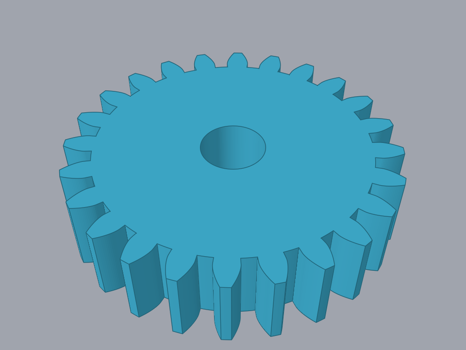
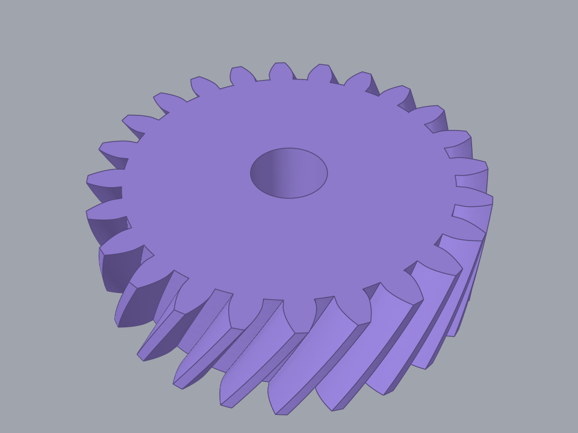
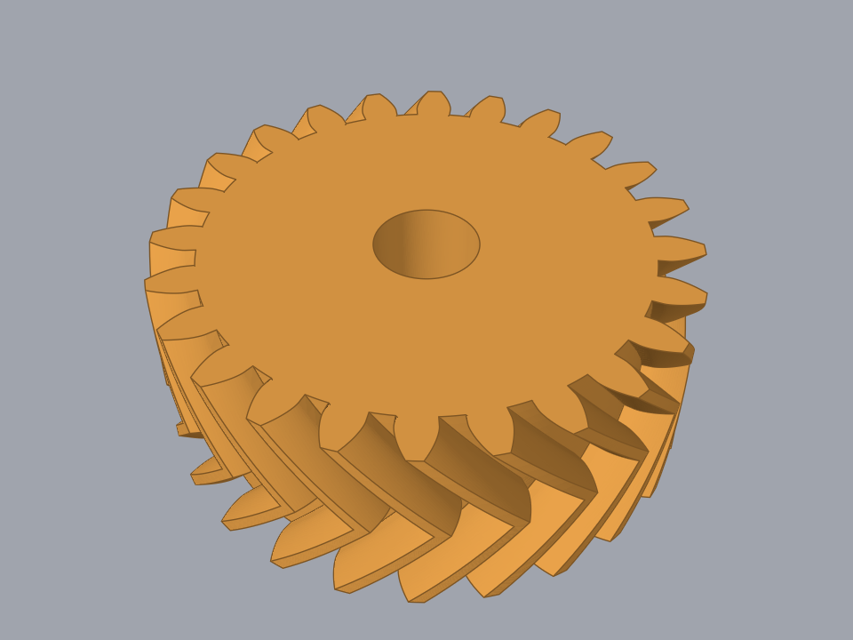
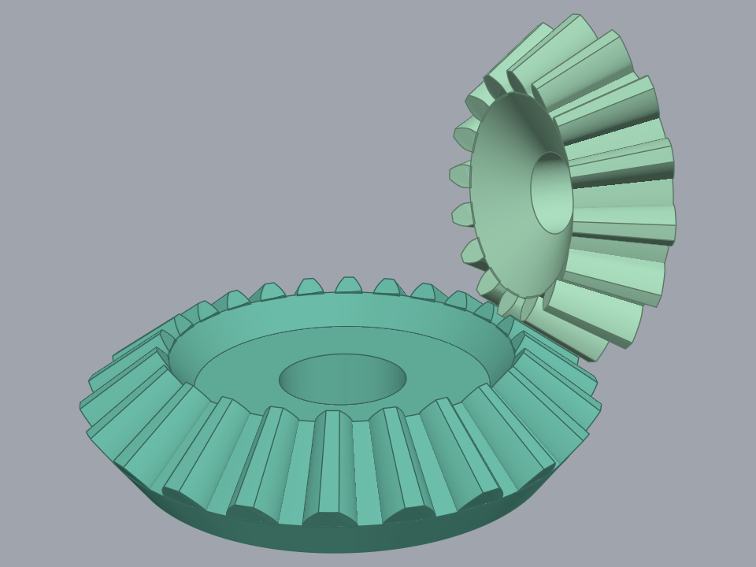
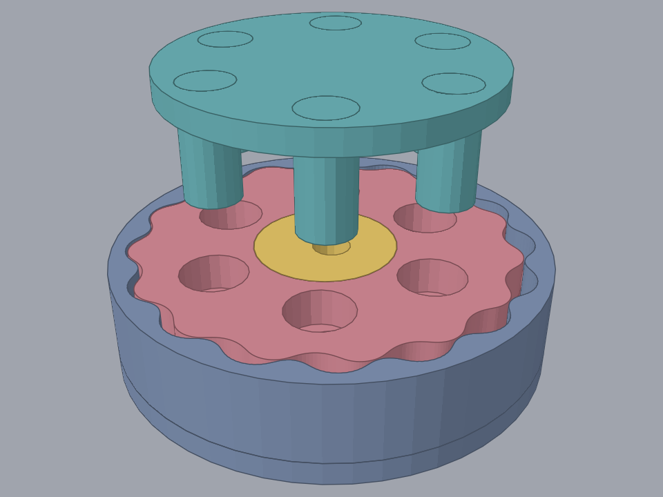

# Gear Generator

This is yet another Gear Generator for Fusion 360.
I know there are a bunch of other tools to do this, I wrote this to scratch my itch, which were:

* Source code legibility - I at least wanted to have code as classes, and not a single giant function
* Fully constrained sketches - Many freely available scripts created gears whose sketches were not fully constrained. This led to funky problems when you wanted to modify or move the generated objects.
* Ability to generate gears on any surface/plane and point pair

On top of the above, there were also a few minor issues that I wanted to see happen:

* Extra information - I know you don't need to draw the pitch circle or the base circle, but I wanted to see them. Also wanted to annotate them by text objects

# Supported Gears

The add-in installs one command per generator into a **Gears** dropdown in the Fusion **SOLID > CREATE** panel:

| Gear | Example |
| --- | --- |
| **Spur Gear**<br>Straight teeth across the rim. Rendered at module 2, 24 teeth, 20° pressure angle, 12 mm thick, 10 mm bore. |  |
| **Helical Gear**<br>The same tooth twisted to the far face, which is what *Helix Angle* sets. Rendered 16 mm thick at 20°. |  |
| **Herringbone Gear**<br>Twisted to mid-body and mirrored, so the teeth meet in a chevron and the thrust cancels. Rendered 20 mm thick at 20°. |  |
| **Bevel Gear**<br>Straight or spiral from the same command. *Mean Spiral Angle* selects between them (0 gives a straight bevel), and *Hand of Spiral* picks the direction. Rendered as a 24/16 pair in mesh at a right angle, module 2, spiral angle 0. |  |
| **Cycloidal Drive**<br>A speed reducer rather than a single gear. It builds the lobed disc(s), the eccentric cam, a pinless ring housing and the output plate with its pins, each in its own sub-component. Rendered at the dialog's defaults with two discs, the plate lifted clear on its own pins so the rest can be seen. |  |

None of those pictures is a drawing of a gear. Every spur, helical and herringbone flank is the
involute the generator itself cuts, sampled from [`proof/involute`](proof/involute), and each of the
three is swept the way its spec sweeps it. Both bevel gears are built from the lattice their own
proof resolves and trimmed by the cones it places, meshing at the phase that proof fixes, and every
part of the cycloidal drive is a body its proof extrudes. A change to the proved geometry moves the
picture with it. The renderer is
[SolidLens](https://github.com/lestrrat-3d/solidlens). Regenerate all five with
`proof/render_examples.sh`, which runs against the engine revisions `proof/go.mod` pins.

# INSTALLATION

This is a standard Fusion 360 add-in. There is no Marketplace package yet, so install it manually:

1. Get the add-in into Fusion's `AddIns` directory, in a folder named exactly `Gear Generator` (it has to match `Gear Generator.py` / `Gear Generator.manifest`).

   * **Windows:** `%APPDATA%\Autodesk\Autodesk Fusion 360\API\AddIns`
   * **macOS:** `~/Library/Application Support/Autodesk/Autodesk Fusion 360/API/AddIns`

   The simplest route is to clone straight into that folder:

   ```sh
   git clone https://github.com/lestrrat-3d/fusion360-gear-generator.git "Gear Generator"
   ```

   If you keep your checkout somewhere else, run `./deploy.sh` from it instead. That script copies only
   the files Fusion actually loads (`Gear Generator.py`, the manifest, `config.py`, `commands/`, `lib/`
   and the `diag_*.py` helpers) and leaves the specs, proofs and tooling behind. It picks the
   destination from `$FUSION_ADDIN_DIR`, then from an untracked `.deploy.conf` beside the script, then
   by searching the standard locations listed above. Re-run it after every change.

   WSL users need `deploy.sh`: Fusion's August 2026 update stopped loading add-ins from
   `\\wsl.localhost` paths, so pointing the `AddIns` folder at a WSL checkout no longer works.

2. In Fusion 360, open **Utilities > Scripts and Add-Ins** (shortcut: `Shift+S`).
3. Switch to the **Add-Ins** tab. `Gear Generator` should appear in the list.
4. Select it and click **Run** (tick *Run on Startup* if you want it loaded automatically).

The commands then live under **SOLID > CREATE > Gears**.

# USAGE

Pick a generator from the **Gears** dropdown, fill in the dialog (module, tooth count, pressure angle,
etc.), and pick the plane/point that places the result. The generated sketches are fully constrained,
the one exception being the bevel tooth-profile and spiral guide sketches, which are exempt for the
reasons recorded in `spec/bevelgear/fusion.md`. The spur, helical and herringbone gears also draw the
root, tip, base and pitch circles alongside the gear body and label each one with its radius. The
Cycloidal Drive checks its inputs as you type and shows the problem next to the offending field,
keeping OK disabled until the values work.

# DEVELOPMENT

The generators under `lib/geargen/` are build output, not hand-written source. Each one is generated
from its natural-language spec in `spec/<gear>/`, driven by the skills in `.claude/skills/`. Geometry
checking is uneven so far: the spur, helical, bevel and cycloidal generators have Go proofs under
`proof/`, which build the real sketches and solids and check them before anything reaches Fusion; the
spur and helical sketch schemes also have benches at `spec/spurgear/sketch/` and
`spec/helicalgear/sketch/`; and the herringbone gear is checked only by loading it into Fusion.

So a fix goes into the spec, or into the shared `.claude/skills/generate-gear/PLAYBOOK.md` when the
behaviour applies to every gear, and then you regenerate. Editing `lib/geargen/<gear>.py` directly
leaves the spec and the proof describing a gear that no longer exists. `CLAUDE.md` covers which skill
regenerates what.

# TODO

* Diametral Pitch handling: I personally just don't need it, but I think it's just a matter of having a conversion table. Patches welcome.
* Error handling: a failed generation now rolls the new component back and reports in a dialog, and the Cycloidal Drive validates as you type. The other gears still need that same live validation.
* User-friendly UI: the dialogs are still plain value and selection inputs. I suck at UI, so if you can help me, I'd be so happy.
* Distribution: I have no idea how to package and otherwise distribute these things on AutoDesk Marketplace. If you can help me with it, I'd be so happy.

# LICENSE

Released under Creative Commons CC-BY-NC 4.0 — https://creativecommons.org/licenses/by-nc/4.0/

For commercial use, please contact the author.
