# The bevel gear, one step at a time

Every picture below is of geometry a step in this proof built. A sketch step's picture is the
sketch that step drew and solved; a solid step's picture is the bodies that step returned. They
are written by `TestStepSnapshots` in [snapshots_test.go](snapshots_test.go), which runs only
when `-snapshot.out` names a directory, so an ordinary proof run writes no images.

The steps are the ones [`spec/bevelgear/steps.md`](../../spec/bevelgear/steps.md) numbers, and
the headings below carry those numbers. One gear runs through the whole sequence: the shipped
dialog default, which is module 1, an equal 31/31 pair at a 90 degree shaft angle with a 35
degree right-hand spiral, taken on the pinion — the member the generator builds first. The
Combine-Join is the one exception, and it says so where it appears.

## What these pictures are not

They are not Fusion's output. The proof substitutes for three things the evaluator will not do,
each of them stated in full at the top of [solids_test.go](solids_test.go), and all three are
visible here:

- **Every solid of revolution is a 32-sided sweep.** decad's revolve publishes a volume no
  measurement can use, so the frustum, the cut cones and the bore tool are each built as a chain
  of lofts between coaxial polygons. The flats on the gear body below are those 32 sides.
- **The tooth's sections are perpendicular to the shaft axis**, not on the back cone, and the
  tooth's loft starts at a stub 5% of the way out from the Apex rather than at a point. decad's
  loft takes two profiles and no point section.
- **No boolean is performed.** A step that would union, trim or pierce builds its operands and
  lays them apart along the shaft axis, and asserts from their own measured geometry what the
  operation would have produced. The pictures move those operands back to where the step
  measures them from, so a body that overlaps another here is a body Fusion would have joined
  or cut.

A finished pair, with both conical trims meshed exactly and the teeth patterned around the ring,
is the bevel picture in the repository README. `TestRenderExample` in
[render_test.go](render_test.go) draws it from this same lattice, at Mean Spiral Angle 0, which
is the straight bevel rather than the spiral one shown here.

## S8 — Anchor sketch

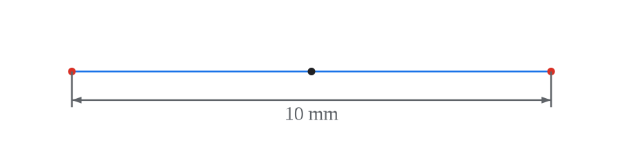

The line is 10 mm long and horizontal in the sketch's own frame, and the black point is the
user's Center Point projected onto the target plane. That point is the line's midpoint, and the
line is what section 2 measures its directions against.

## S10 — Gear Profiles sketch, the section 2 lattice

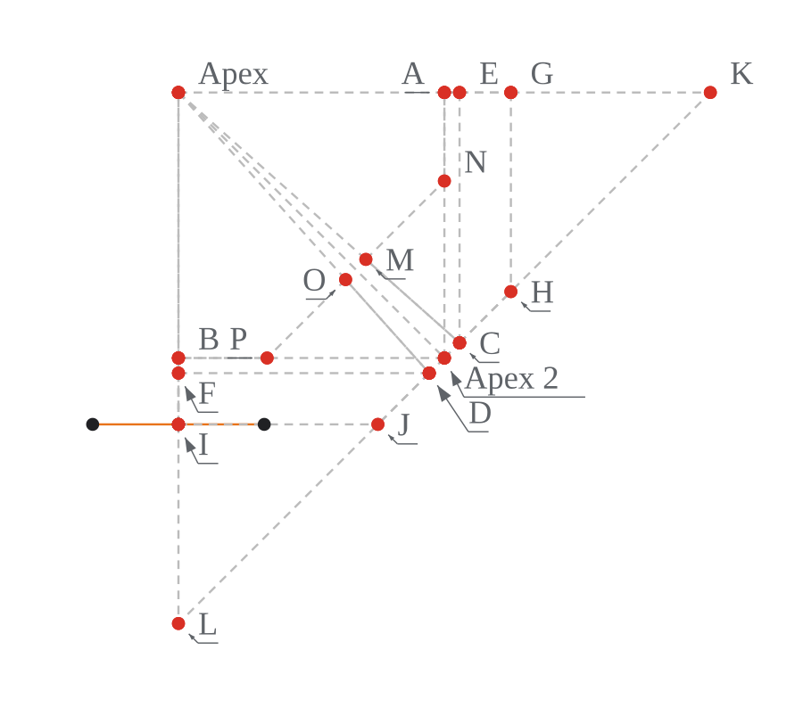

The whole lattice in the axial plane, with the anchor line projected into it in orange at the
left. The dashed lines are construction geometry and the red points are the vertices both gears'
profiles are later recreated from. The thirteen dimensions that hold the lattice are not drawn:
their labels overlap into a block of text at this size.

## S12 — `{gearLabel} Tooth` sketch, the virtual spur tooth


The tooth's cross-section at the heel: two spline flanks, a tip arc and a root arc. The frame
runs from the shaft axis on the right to the tooth on the left, which is why most of it is
empty — the tooth is 2.25 mm from root to tip and sits 14.5 mm out from the axis. The point
markers are off here, because one marker per spline sample covers the flanks they sample.

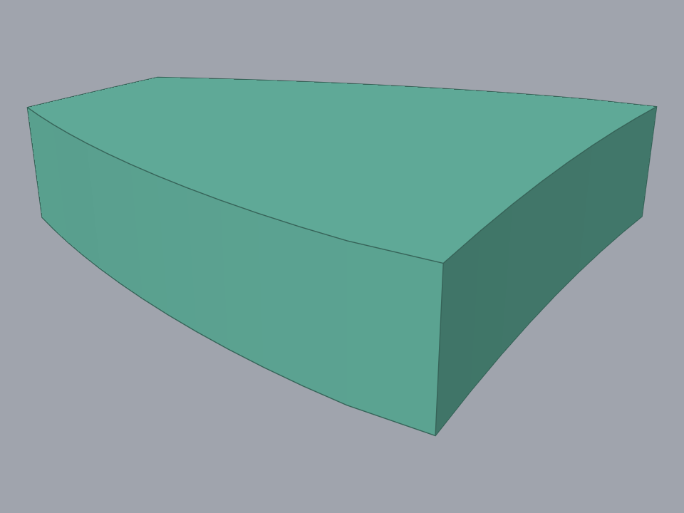

The solid the harness gates is that loop's chorded twin, extruded a nominal thickness. This is
the one bevel sketch not gated on `isFullyConstrained`: the borrowed spur generator labels its
circles with along-path text, and sketch text holds a degree of freedom, so the step is proved
through the solid instead.

## S15 — `{gearLabel} Profile` sketch, the frustum hexagon

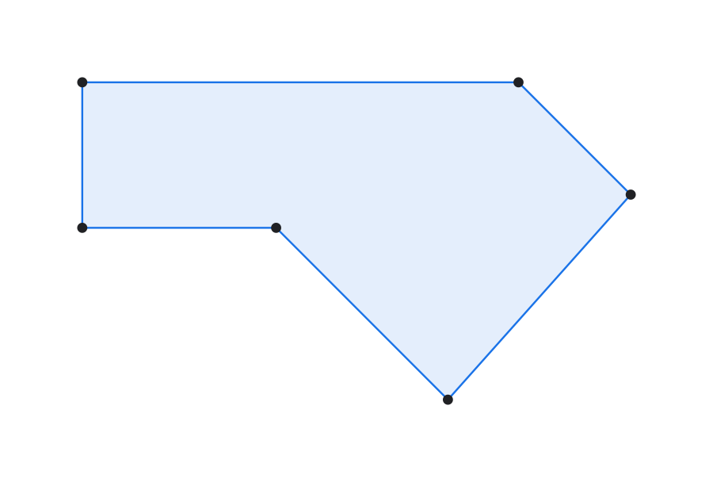

The six section 2 vertices recreated as new points, the closed hexagon drawn sharing them, and
the endpoints fixed only after the lines exist. The fill is the sketch's one closed region,
which is what lets the revolve take its profile without filtering. Its left edge lies on the
shaft axis.

## S16 — Revolve the hexagon into the Gear Body

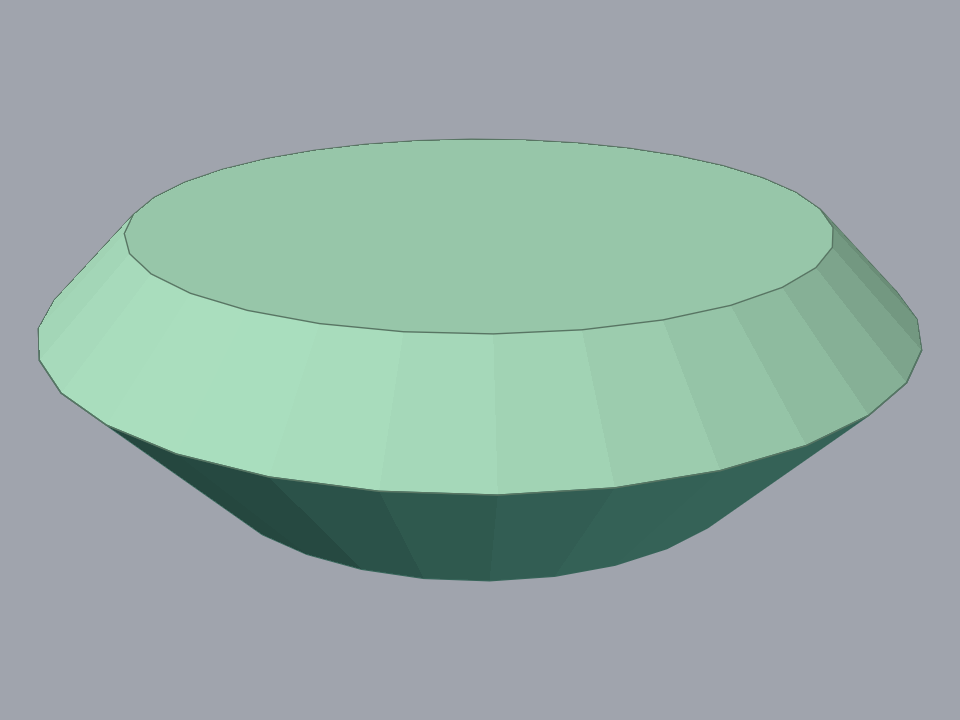

The hexagon swept a full turn. The flat face at the top is the heel, at 19.4 mm from the Apex
along the shaft; the surface tapering below it runs toward the toe and the Apex. Three bands are
drawn, each in its own colour and each gathered back to where the step measures it: the cone the
root edge sweeps, the band at the heel, and a plug that lies inside the first two and hollows
the toe dish. The gear body is the first two minus the plug, and no boolean is performed here,
so all three are present and overlapping.

## S17 — Loft the Apex point to the tooth profile

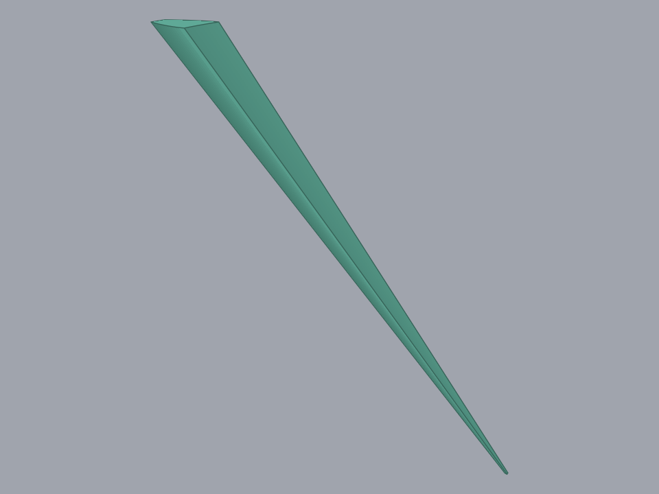

One tooth, lofted from the stub near the Apex out past the heel. Its radial size at any station
is proportional to its cone distance, which is what makes one lofted tooth serve the whole face
width. Both ends overrun on purpose: S18 is what trims them.

## S20 — `{gearLabel} Cone Element` sketch

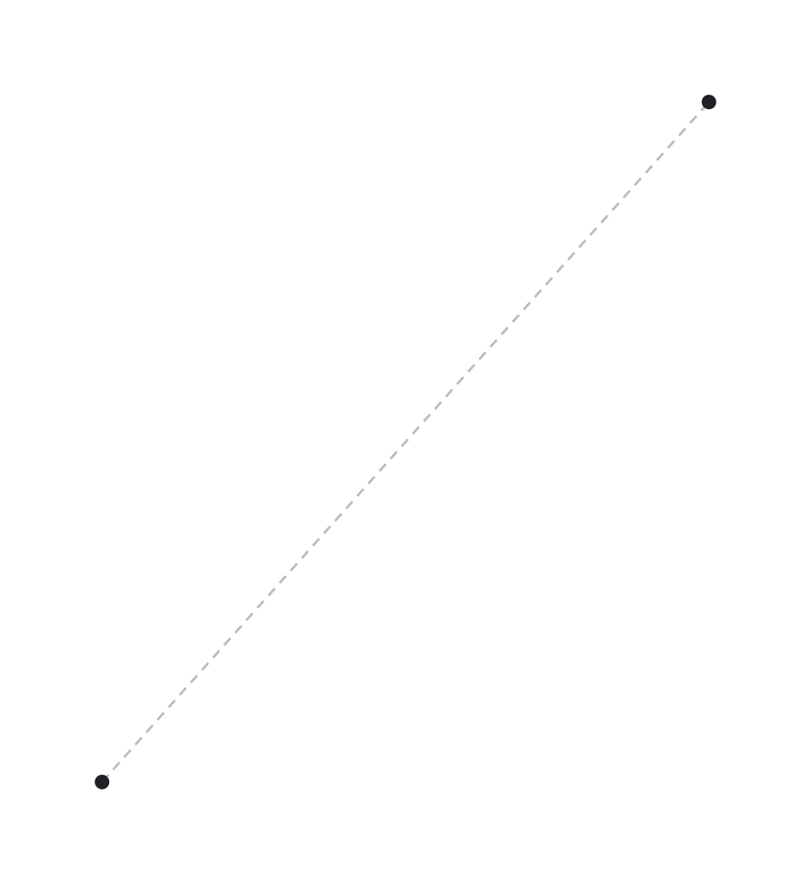

One construction line, from the Apex to the heel cone distance, along the root cone element. The
Trace Plane is the axial plane rotated about this line, so the line being the root cone element
and not the pitch line or the shaft axis is the whole content of the step.

## S22 — `{gear} 2D Tooth Trace` sketch, the cutter arc

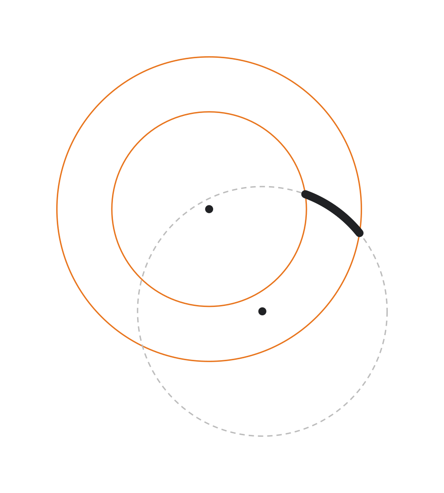

The tangent plane, with the Apex at the upper dot and the cutter circle's centre at the lower
one. The two orange circles are the toe and heel apex circles, the dashed circle is the cutter,
and the black arc between the two orange circles is the tooth's lengthwise centreline. The
proof samples the genuine cutter circle rather than building Fusion's three-point arc, for the
reason [sketches_test.go](sketches_test.go) gives at that step.

## S23 — Slice the tooth into cross-section slabs

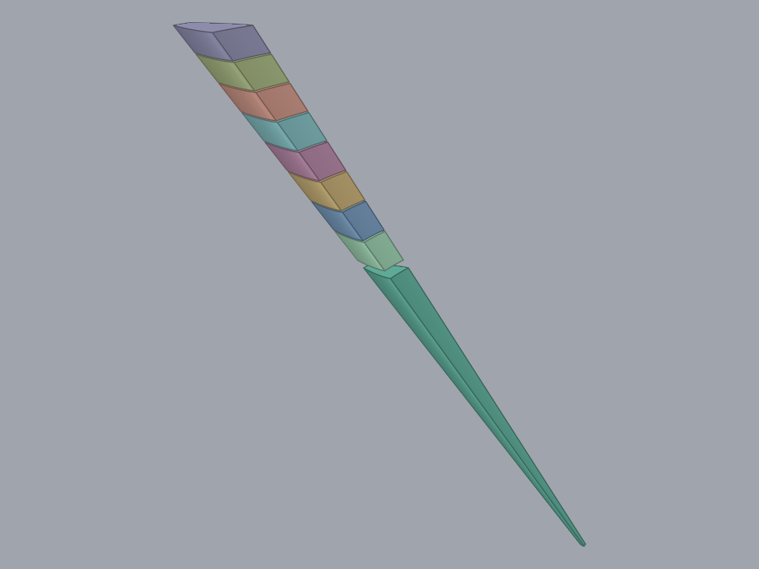

Eight planes leave nine pieces. The long piece running down to the Apex is the scrap; the eight
above it are the cross-section slabs the spiral is built from. Each slab is pulled back from its
cut plane by a fortieth of its own length at both ends, which is the gap visible between them:
two bodies that share a face come back from decad's verification undecided rather than
disjoint.

## S24 — Order the slabs and drop the apex scrap

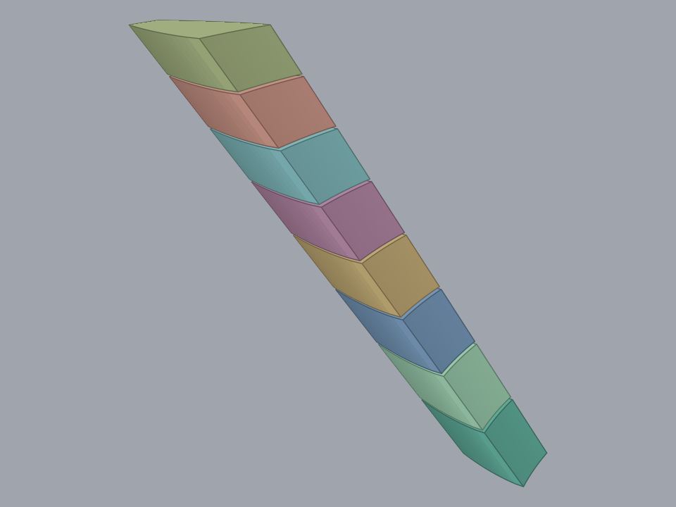

The pieces sorted by the cone distance of their centroid, with the apex-most one removed. What
remains starts at the last cut plane. The piece that went is the material a toe trim would
otherwise have had to take off.

## S25 — Twist the slabs about the shaft axis


Each slab turned about the shaft axis by its own share of the total twist, keyed to the cone
distance of its heel face. The share is centred on the mean cone distance, so the middle of the
stack is where it was and the two ends carry equal and opposite turns.

## S26 — Crown the slabs lengthwise

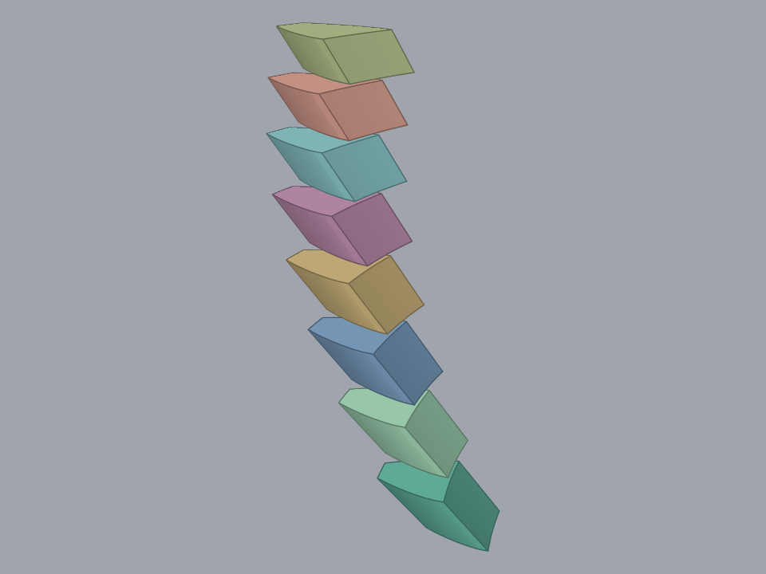

The same stack with each slab built at its crowned size. The change from S25 is at the tips: the
root radius is untouched and the tip radius scales, which is what a uniform scale about a root
point does. Six percent of the pixels differ between this picture and the last.

## S29 — Combine-Join

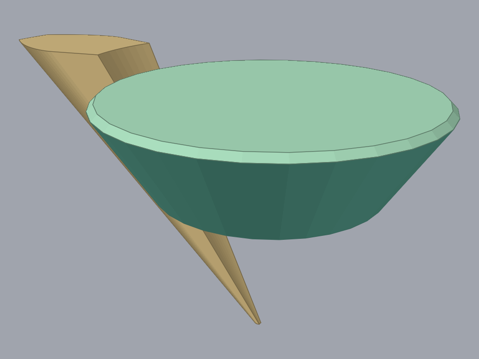

The frustum's three bands and one tooth, gathered to where the join would happen. The tooth here
is the uncut loft, because the trim is not performed in this proof, and it runs from the Apex
out past the heel for that reason. This is the one picture taken on a different case: the join
is one boolean per tooth, so its proof table keeps the count at 8, and 8 teeth on a module 1
gear is also what leaves a tooth wide enough to see.

## S30 — `{gearLabel} Bore` sketch

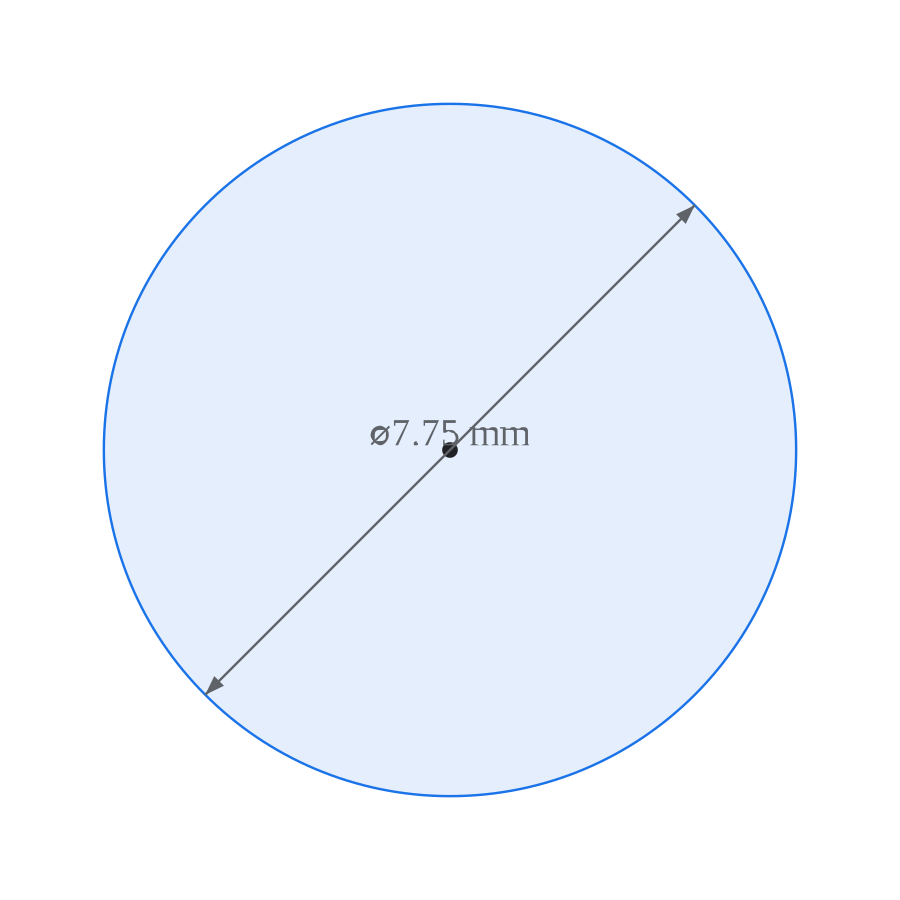

The bore circle, its centre fixed at the sketch origin and its diameter dimensioned. The
diameter shown, 7.75 mm, is the "0 means auto" branch resolving to this gear's pitch diameter
divided by four.

## S31 — Bore through-cut

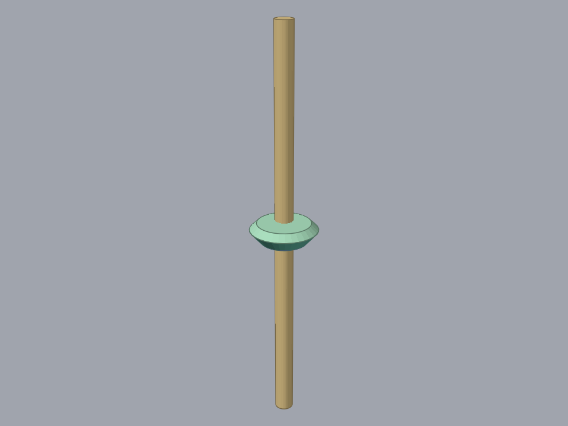

The gear body's three bands, and the tool in gold. The tool is a symmetric extrude of the bore
circle, two cone distances per side, which is why it stands so far past both ends of the body.
That overrun is what makes the cut a through cut, and it is one of the things the step measures.

## Steps with no picture

Four steps build geometry and are still absent above, and in each case it is that step's own
substitution that leaves nothing to photograph.

**S18, the conical end trims.** The step returns the tooth and the two cones that would trim it.
Each cone reaches three dedendum radii times `tan(gamma)` back from its own apex, so it is
several times the size of the tooth, and the renderer has no transparency: an opaque cone fills
the frame. The trim is not performed either, so the tooth inside it is the uncut loft S17
already shows.

**S27, lofting the curved tooth.** The bands it lofts are the slabs S26 already built, from the
same stations at the same twist and crown. Its image came out byte-identical to S26's.

**S28, the circular pattern.** The proof applies one pattern increment to the seed tooth rather
than making N copies, and that increment turns the only body in the frame.

**S32, the meshing rotation.** The bodies rotated are the frustum's bands, which are solids of
revolution turned about their own axis. Every pixel stays where it was.

The remaining steps build no geometry at all: S1 to S4 and S6 are the module layout, the command
dialog, the conditional inputs and the input reading; S5 resolves the derived values and bounds
as numbers; S7, S9, S11, S13, S14, S19, S21, S33 and S34 create components, planes, axes and the
occurrence tree, or move and clean up at the end.

## Regenerating

```sh
cd proof
GOWORK=off go test ./bevelgear -run '^TestStepSnapshots$' -snapshot.out=./images -count=1
```

`./images` is relative to this directory rather than to the one the command is run from, because
`go test` runs a test binary in its own package's directory.

`GOWORK=off` is what [render_examples.sh](../render_examples.sh) uses and for the same reason:
the images are then built against the engine revisions `proof/go.mod` pins, out of the module
cache, rather than against whatever checkout sits beside the repository. `-count=1` is needed
because a cached PASS writes no files.

Nothing checks these images. They are regenerated by hand when a step changes what it builds,
and the test that writes them fails to compile if a step is renamed or removed.
