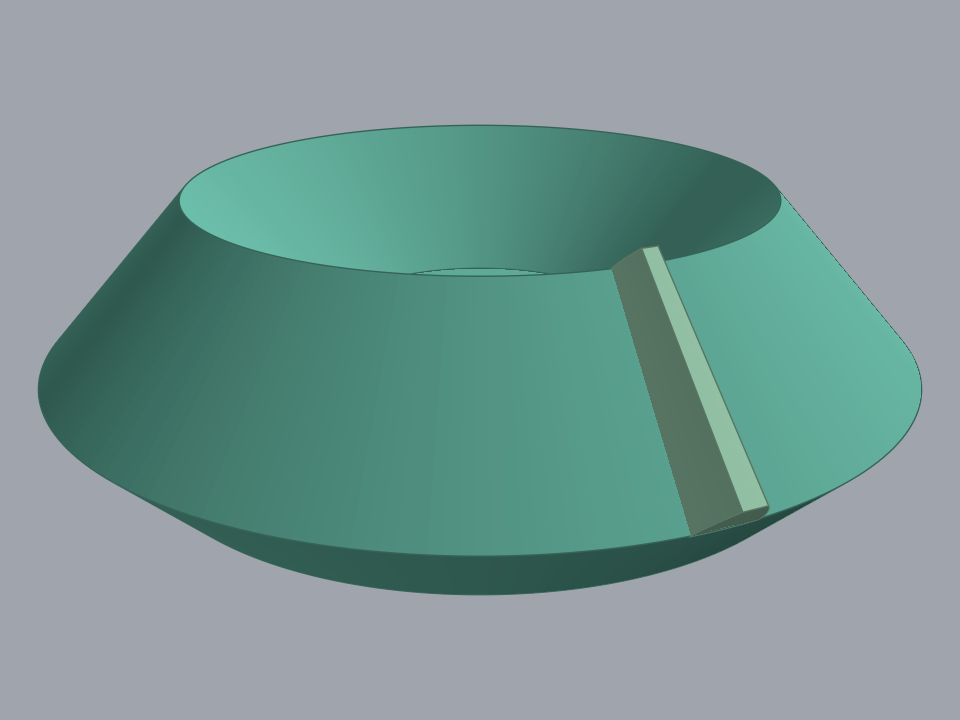
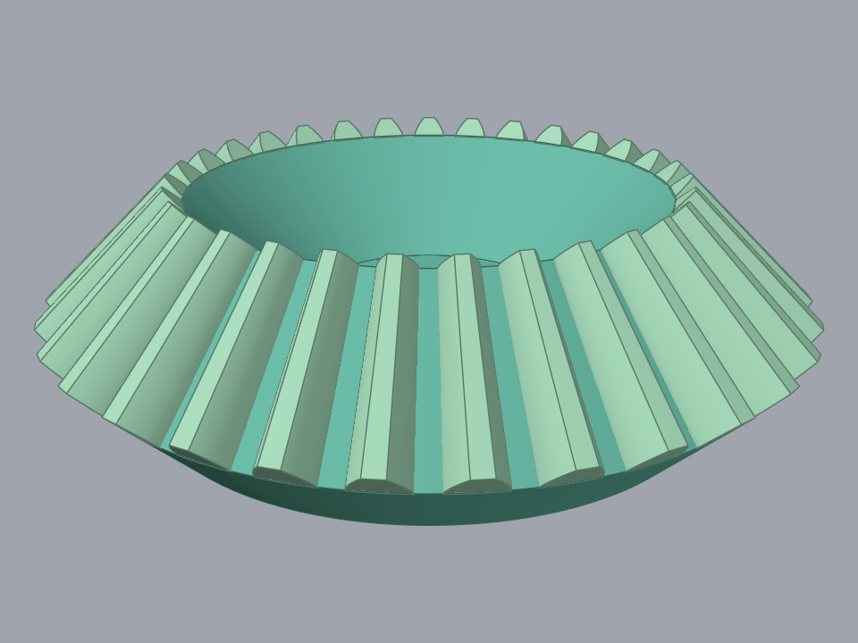
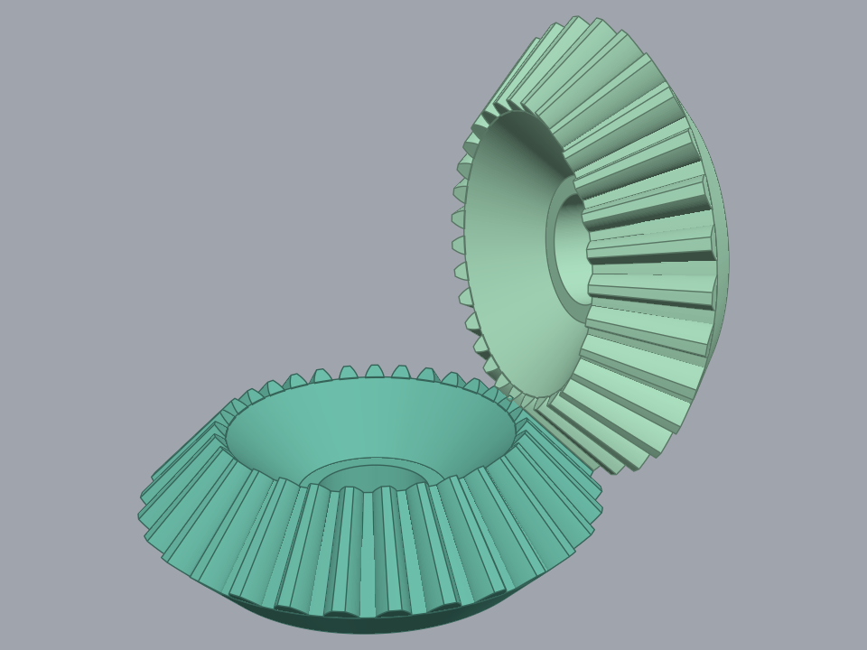

# The bevel gear, one step at a time

These pictures are the gear the command builds, taken step by step, at the numbers
[`spec/bevelgear/steps.md`](../../spec/bevelgear/steps.md) gives each step. The solid ones are
meshed by [render_test.go](render_test.go)'s model, the one the repository README's bevel
picture is drawn with; the sketch ones are drawn by the proof's own sketch steps, which draw the
sketch the generator draws. `TestStepSnapshots` in [snapshots_test.go](snapshots_test.go) writes
them, and it runs only when `-snapshot.out` names a directory, so an ordinary proof run writes
no images.

One gear runs through the sequence: the shipped dialog default with the Mean Spiral Angle at 0,
which is module 1, an equal 31/31 pair at a 90 degree shaft angle, taken on the pinion — the
member the generator builds first. The last picture is the pair.

Each picture is the gear as that step leaves it, so the sequence is cumulative. Where a step
adds a body the new body is drawn in the lighter shade until the Combine-Join, after which the
gear is one body and takes one colour.

## What these pictures are not

No image here comes from Fusion. Loading a gear into Fusion is still the only check that sees
the real thing, and it is the one this repository cannot run.

The solid model performs what the geometry proof in this directory substitutes for: the Gear
Body is a real solid of revolution, the tooth is trimmed exactly on the two cones the body's toe
and heel faces lie on, the ring carries every tooth, and the bore is taken out of the revolve
profile. Nothing is laid apart and nothing is faceted to 32 sides.

It simplifies one thing. Fusion draws the virtual spur tooth on the `{gearLabel} Plane`, which
is tilted from the axis-perpendicular plane by the pitch cone angle, and lofts to it from the
Apex point. These pictures put that same tooth outline on axis-perpendicular sections scaled
about the Apex, which is the Tredgold mapping the tooth's own construction already applies. The
tooth's size, its curve inventory, its taper and both conical trims are the real ones; the tilt
of the plane it is drawn on is not.

## S8 — Anchor sketch


The line is 10 mm long and horizontal in the sketch's own frame, and the black point is the
user's Center Point projected onto the target plane. That point is the line's midpoint, and the
line is what section 2 measures its directions against.

## S10 — Gear Profiles sketch, the section 2 lattice


The whole lattice in the axial plane, with the anchor line projected into it in orange at the
left. The dashed lines are construction geometry and the red points are the vertices both gears'
profiles are later recreated from. The thirteen dimensions that hold the lattice are not drawn:
their labels overlap into a block of text at this size.

## S12 — `{gearLabel} Tooth` sketch, the virtual spur tooth


The tooth's cross-section at the heel: two spline flanks, a tip arc and a root arc. The frame
runs from the shaft axis on the right to the tooth on the left, which is why most of it is
empty — the tooth is 2.25 mm from root to tip and sits 14.5 mm out from the axis. The point
markers are off here, because one marker per spline sample covers the flanks they sample.

## S15 — `{gearLabel} Profile` sketch, the frustum hexagon


The six section 2 vertices recreated as new points, the closed hexagon drawn sharing them, and
the endpoints fixed only after the lines exist. The fill is the sketch's one closed region,
which is what lets the revolve take its profile without filtering. Its left edge lies on the
shaft axis.

## S16 — Revolve the hexagon into the Gear Body


The hexagon spun a full turn. The dish facing the camera is the toe end, the end the teeth
taper to; the heel is the wide face underneath. The bore is not in it yet — S30 draws it and
S31 cuts it.

## S17 — Loft the Apex point to the tooth profile


One tooth, lofted from the Apex point to the tooth profile at the heel. It is drawn in the
lighter shade because it is a separate body until the Combine-Join, and the picture is taken
from its own side of the gear. Both of its ends run past the Gear Body, which is what S18 is
there to cut back: the Apex end reaches up into free space and the heel end stands out past the
body's rim.

## S18 — Conical end trims, the flush band



The same tooth, trimmed by the two cones the Gear Body's own toe and heel faces lie on. What is
left is the flush band: the tooth now starts and ends exactly where the body does, and its two
end faces are conical rather than flat because the cones they were cut by are.

## S28 — Circular pattern



That one tooth patterned into all 31 of them, at 360/31 degrees apart. The spacing stays the
same the whole way along the face width even though the pitch diameter shrinks toward the toe,
because the taper is already in the lofted tooth.

## S29 — Combine-Join


The same geometry in one colour, which is what the join makes of it: the Gear Body and its 31
teeth stop being separate bodies and become one.

## S30 — `{gearLabel} Bore` sketch


The bore circle, its centre fixed at the sketch origin and its diameter dimensioned. The
diameter shown, 7.75 mm, is the "0 means auto" branch resolving to this gear's pitch diameter
divided by four.

## S31 — Bore through-cut


The bore cut along the shaft axis, through the whole body. The camera stands steeper for this
one picture: the bore comes out in the floor of the toe dish, and from the viewpoint the rest of
the sequence is shot from the dish's own rim hides all but a few pixels of it. The diameter is
the 7.75 mm S30 dimensioned.

## S32 — Meshing rotation



The pair, which is the only thing the meshing rotation can be seen in. The driving gear is
turned half a tooth pitch about its own shaft, so that its valley meets the pinion's tooth
rather than tooth meeting tooth. Both members come out of the one case, exactly as the command
builds them.

## Steps with no picture

**S19 to S27, the spiral path.** At Mean Spiral Angle 0 the command does not run them at all:
the tooth-body hook returns the conical end trims of S18 and no trace, no slices, no twist and
no crown are built. A spiral bevel builds its tooth through those steps instead, and nothing
here shows that.

**The steps that build no geometry.** S1 to S4 and S6 are the module layout, the command dialog,
the conditional inputs and the input reading. S5 resolves the derived values and the input
bounds as numbers. S7, S9, S11, S13, S14, S33 and S34 create components, planes, axes and the
occurrence tree, or move the finished body and clean up.

## Regenerating

```sh
cd proof
GOWORK=off go test ./bevelgear -run '^TestStepSnapshots$' -snapshot.out=./images -count=1
```

`./images` is relative to this directory rather than to the one the command is run from, because
`go test` runs a test binary in its own package's directory.

`GOWORK=off` is what [render_examples.sh](../render_examples.sh) uses and for the same reason:
the images are then built against the engine revisions `proof/go.mod` pins, out of the module
cache, rather than against whatever checkout sits beside the repository. `-count=1` is needed
because a cached PASS writes no files.

Nothing checks these images. They are regenerated by hand when a step changes what it builds,
and the test that writes them fails to compile if a step is renamed or removed.
