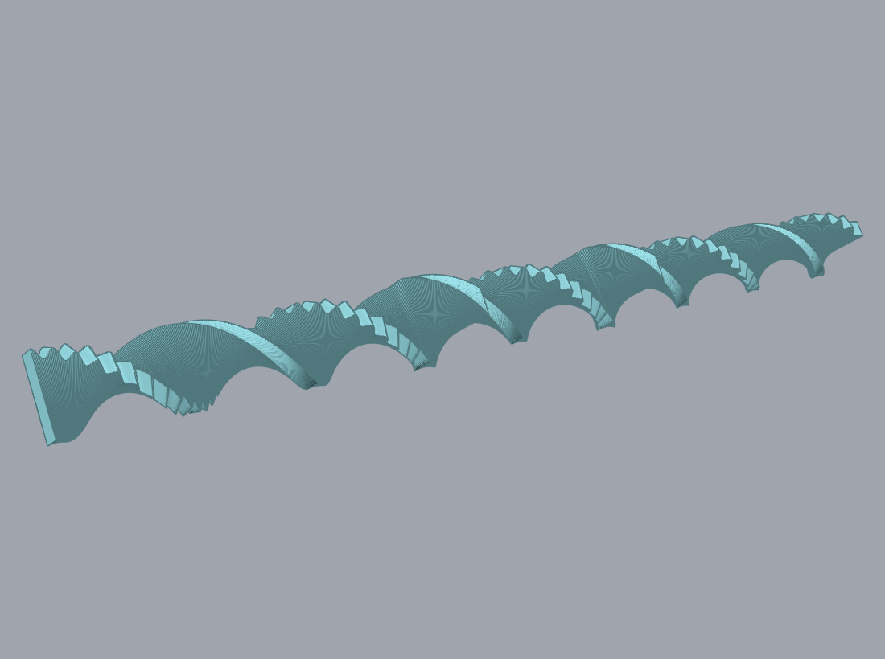
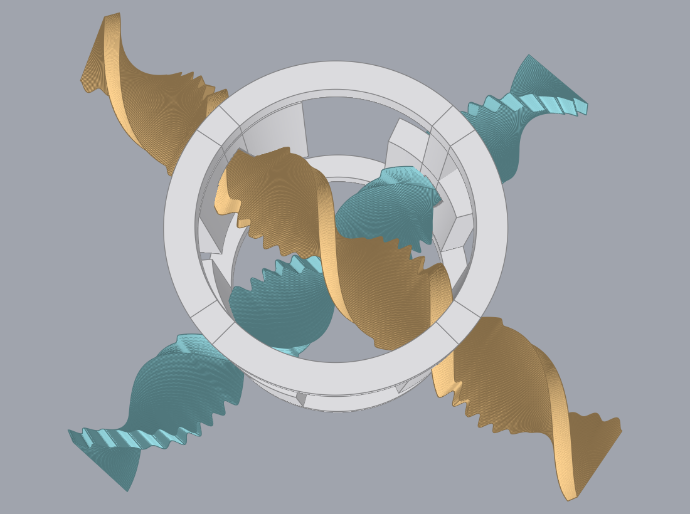
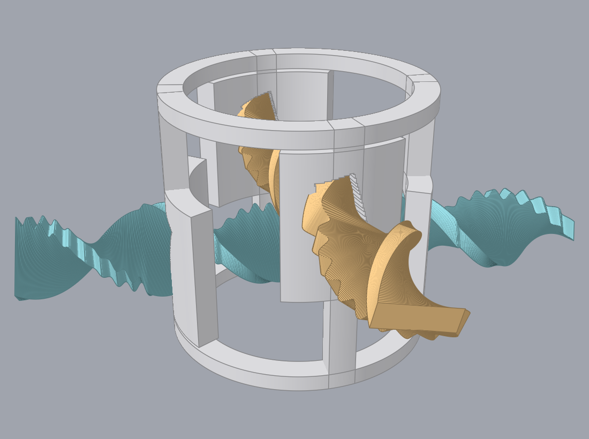
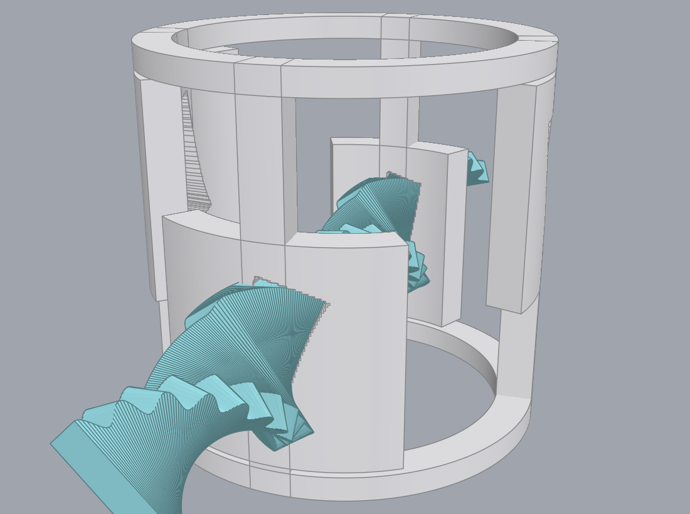
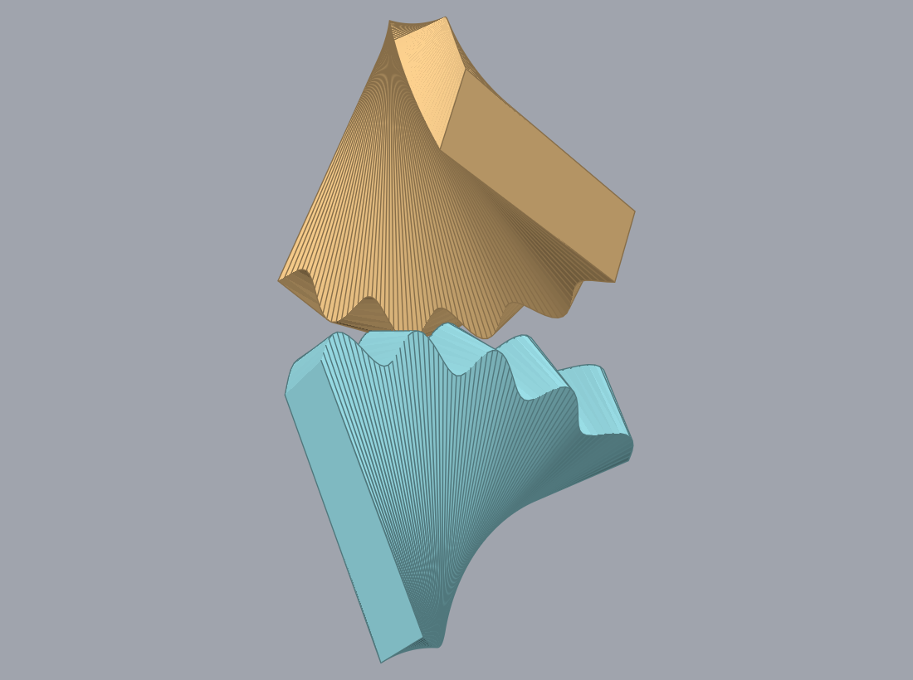
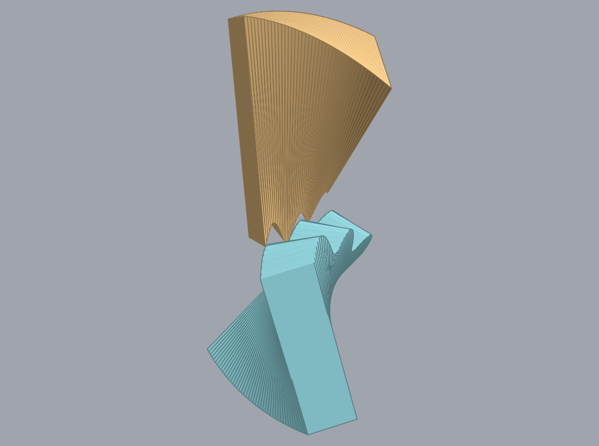

# The screw gearing, in pictures

These are the parts [`spec/screwgear/instructions.md`](../../spec/screwgear/instructions.md)
describes, drawn at the defaults that spec's table gives. Every section in every picture comes
from `Gear.section` in [geometry_test.go](geometry_test.go), the same function the meshing proof
samples, so a change that moves the proved geometry moves these pictures with it. The three
`TestRender` cases in [render_test.go](render_test.go) write them, and they run only when
`-render.out` names a directory, so an ordinary proof run writes no images.

The mechanism is a screw/screw gearing: two racks, each twisted into a helix about its own centre
line, each moving by a screw motion — turning as it advances — in a cage that holds them. Pushing
one along its axis drives the other, 1:1. It comes from Henry Segerman's video
[Screw/screw gearing](https://www.youtube.com/watch?v=0ZPo3HxR0KI), which is the only known
example of one.

## What the pictures show, and what they do not

No image here comes from Fusion, and nothing in this directory builds a Fusion body. Loading a
gear into Fusion is still the only check that sees the real thing.

The pictures draw the **ideal** ribbon: an exact cosine edge on an exact helicoid, which is what
the proof reasons about. The part Fusion builds lofts twelve rectangles per tooth, and
`TestLoftSectionCountHoldsTheHelicoid` bounds the difference between the two at 0.7 µm against a
0.45 mm backlash. That bound is arithmetic about the loft rather than a measurement of one.

The bores are drawn on a grid: a cell of a post's block is dropped when it falls in the channel the
turning ribbon sweeps, which is the same local mapping the meshing proof uses. A boundary running
across the grid's rows can still step, and those steps are in the drawing rather than the geometry.

## The part



One gear. It is a flat plate 10 mm wide and 2.5 mm thick with a cosine tooth form cut into one
long edge, 40 teeth at a 1.75 mm pitch, twisted about its own centre line at 30 mm per turn — a
little over two full turns across its 70 mm.

The toothed edge is the one that spirals, and the twist is what the crossing angle is made of:
`Sigma = 2*Beta` ties the two axes' angle to this edge's own helix angle, so a slower twist would
give a straighter part AND a pair whose axes lie almost side by side.

The teeth are 1.2 mm from crest to root, a little over a tenth of the plate's width.

## The pair



Both gears, seen from almost overhead, which is the only view that shows the angle their axes
cross at. That angle is 80°. The crossed-helical rule would make it twice the toothed edge's helix
angle, which is 92.6° here, and the search picks 80° instead: the arrangement also has to carry a
frame whose bores can be printed.



The same assembly from the side. The two axes are 9.64 mm apart along the frame's own axis, and the
two gears are the same part, held at the same 15° angle. Equal angles are what let all four bores
stand near upright.

## The frame



The frame with one gear left in it. It is a short tube with most of its wall gone: a flat plate at
each end, and four posts between them, each widening into a block around its bore. Each post sits where one ribbon crosses the cylinder
and carries a **bore** that ribbon passes through. Two posts are bored low and two high, so the two
gears pass at different heights and their teeth meet in the middle.

**The bore is what holds a gear to its screw motion.** It is cut to the ribbon's own cross-section
and twisted at the ribbon's own lead, so a gear that turns without advancing jams in it.
`TestBoresAdmitOnlyTheScrewMotion` measures that: 3.21° out of step and the gear locks. A frame of
round holes would report no jam at any angle, which is the case that rules out.

**Every outside face lies on one cylinder.** The plates, the posts and the blocks are all pieces of
the same wall, differing only in how far round and how far up each runs, so nothing stands proud of
anything else and the outside reads as one turned surface rather than bars stuck onto plates.
`TestNothingStandsProudOfTheShell` holds it: the whole frame lies between radius 13.50 and 16.50.
The plates' top and bottom faces are flat and level, and they are what a print stands on. Only the
bore inside is skewed, which is the skew the mechanism actually needs.

**What passes through a bore is never a tooth.** The ribbon swells into a smooth boss at each of the
two places it crosses the cage, and the bore is cut to the boss. That is why the frame is plain
round bar and plain rectangular openings, with nothing anywhere shaped like a tooth, and why nothing
bears on a crest. The boss travels with its gear, so its length is the stroke: 4.40 mm, or 2.5
teeth.

## The mesh



The crossing, close up. The crests of the lower gear sit in the roots of the upper one, engaged
0.60 mm of the 1.2 mm tooth height. This is the picture that settles whether the teeth engage at
all, which is the one thing about this gear that no number on a page shows.



The same engagement from across the crossing. The two tooth rows run at an angle to each other
rather than along one line, so what this pair carries is a **point contact**, like a crossed
helical pair, and not the line contact a spur pair has. That angle is also what the Mounting
Angles are there to work around: with both toothed edges pointing straight at each other, about
four tooth pairs land in the engaged zone at once and cannot all interdigitate, and the pair jams.
`TestSymmetricMountJams` holds that.

## What the proof measures on these parts

| Quantity | Value |
|---|---|
| Ratio | 1:1, the free window advancing exactly one pitch per pitch |
| Backlash | 0.411–0.481 mm |
| Departure from the 1:1 line | 0.064 mm, 3.7% of the pitch |
| Clearance away from the teeth | 0.168 mm at the closest approach |
| Bore angle | 15° off upright, which is the best the mounting angles allow |
| Play in the frame | a bore jams a gear 3.21° out of step |
| Stroke | 5.03 mm, or 2.9 teeth |

`TestPairDrivesOneToOne` is where the first four come from. It tracks the interval of gear B's
tooth phase that clears gear A through a full pitch of A, and requires three things of it: that
it is never empty, that it is narrower than a pitch, and that its centre advances by exactly one
pitch. The third is what separates a gear from two parts that merely touch, and an arrangement
tried earlier passed the first two and failed it.

## What has no picture

**The tooth cell and its screw step.** The spec builds a ribbon as one tooth cell repeated by a
screw step, and `TestRibbonIsInvariantUnderItsScrewStep` is what licenses that, but the pictures
draw the whole ribbon from its sections and never form a cell.

**Anything a generator does.** There is no `lib/geargen/screwgear.py` yet, and no compiled step
list, so there is no build sequence to show step by step the way
[`proof/bevelgear/README.md`](../bevelgear/README.md) does.

## Regenerating

```sh
cd proof
GOWORK=off go test ./screwgear -run '^TestRender' -render.out=./images -count=1
```

`./images` is relative to this directory rather than to the one the command is run from, because
`go test` runs a test binary in its own package's directory.

`GOWORK=off` is what [render_examples.sh](../render_examples.sh) uses and for the same reason:
the images are then built against the engine revisions `proof/go.mod` pins, out of the module
cache, rather than against whatever checkout sits beside the repository. `-count=1` is needed
because a cached PASS writes no files.

Nothing checks these images. They are regenerated by hand when the geometry changes.
