# The screw gearing, in pictures

These are the parts [`spec/screwgear/instructions.md`](../../spec/screwgear/instructions.md)
describes, drawn at the defaults that spec's table gives: the ribbons and the printable sleeve that
holds them. Every ribbon section in every picture comes from `Gear.outline` in
[geometry_test.go](geometry_test.go), whose toothed side is `Gear.edgeAt`, the same function the
meshing proof samples, and the
sleeve's surface comes from `sleeve.inFrame` in [sleeve_test.go](sleeve_test.go), the same test
the sleeve's proof walks, so a change that moves the proved geometry moves these pictures with it.
The three `TestRender` cases in [render_test.go](render_test.go) write them, and they run only
when `-render.out` names a directory, so an ordinary proof run writes no images.

The mechanism is a screw/screw gearing: two racks, each twisted into a helix about its own centre
line, each moving by a screw motion — turning as it advances — in a cage that holds them. Pushing
one along its axis drives the other, 1:1. It comes from Henry Segerman's video
[Screw/screw gearing](https://www.youtube.com/watch?v=0ZPo3HxR0KI), which is the only known
example of one.

## What the pictures show, and what they do not

No image here comes from Fusion, and nothing in this directory builds a Fusion body. Loading a
gear into Fusion is still the only check that sees the real thing.

The pictures draw the **ideal** ribbon: an exact leaned cosine edge on an exact helicoid, which
is what the proof reasons about. The part Fusion builds is a four-tooth cell lofted through 41
rotated sections, ten to the tooth, each a rectangle whose toothed side is a fitted spline
through eleven points of the edge, repeated by a screw step.
`TestLoftSectionCountHoldsTheHelicoid` bounds how far a *ruled* loft through those sections
would fall from the ideal: 1.0 µm at the crest, where a ruled surface cuts the corner of the
helicoid, and 0.064 mm on the toothed edge, which it draws as a chord of the cosine between
sections, against a 1.08 mm backlash. `TestToothSplineHoldsTheEdge` bounds a natural cubic
spline through the eleven points at 0.018 mm from the edge. Fusion's loft through more than two sections is smooth
between them rather than ruled, so those bounds are arithmetic about a body other than the one
built; the built surface passes through the same sections, and nothing here measures how far it
departs between them. Fusion measured it on 2026-09-28: within 0.04 mm at every midpoint
between sections, at the 10 mm ribbon the defaults were then, with four-line sections
(`spec/screwgear/fusion.md` `[SCREW-F-CELL-LOFT]`); the 1.5× ribbon with its spline sections has
not been measured. The pictures draw each section's toothed side through 13 points across the
thickness.

The sleeve is a tube with four holes and two windows cut through it, and the pictures have no
boolean to cut them with. `sleeveSharpMesh` in [sleeve_mesh_test.go](sleeve_mesh_test.go) meshes
the surface of the set `sleeve.inFrame` describes by dual contouring on a 0.1 mm grid. It finds
where the surface crosses each grid edge by bisecting against `inFrame`, takes the normal there
from the face the point lies on (a cylinder, an end plane, a bore's twisted wall or a window's
side), and gives each grid cube one vertex where those faces' planes meet. Where two or three
faces meet in a cube the vertex lands on their edge or corner, so the rims, the bore mouths and
the window edges come out as single lines. `checkSleeveMesh` fails the render unless every vertex
has a point inside the sleeve and a point outside it within 0.001 mm and every edge of the mesh is
shared by exactly two triangles, one running it each way; `TestSleeveMeshDrawsTheFrame` runs the
same check on a 0.5 mm grid with the proofs. One vertex a cube cannot follow a wedge thinner than
a cube, so where a bore's wall leaves a cylinder at a shallow angle, as at the pointed tip of a
bore's mouth, the edge still shows a few short ticks about one grid cube long.

The channel's wall drawn here is the ideal, and so is the one Fusion cuts: each bore is one sweep
of its section along the axis with a twist, a rectangle turning rigidly, with no sections and no
facets. The proof's solid engine has no twisted sweep, so the compiled step proof builds each
bore's channel as a chain of two-section lofts through eighteen rotated rectangles.
`TestSleeveBoreSubstituteKeepsItsClearance` measures what a ruled wall through those sections
costs against the true channel, with the wall flat between sections and every facet a little
inside it: 0.007 mm of the 0.20 mm clearance. decad does not build that ruled wall. It walls each
cell between two sections with two flat triangles, which depart from the ruled wall by up to a
quarter of the cell's twist: 0.32 mm on the bore's long faces and 0.09 mm on its short ones, more
than the clearance on the long faces. The same test logs those figures and holds nothing to them,
so no clearance is read off the stand-in; the compiled proof reads the cage's volume and the
build's probes off it. It is the one case in the hand-written proof that reasons about a
stand-in rather than about the ideal shape.

## The part

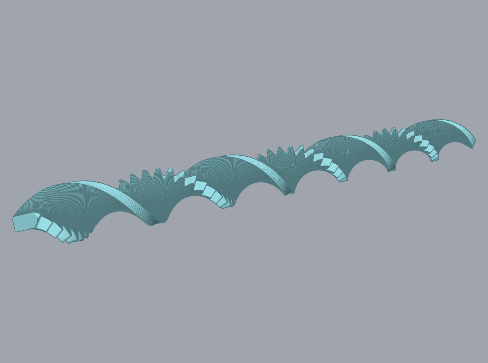

One gear. It is a flat plate 15 mm wide and 3.75 mm thick with a cosine tooth form cut into one
long edge, 68 teeth at a 2.625 mm pitch, twisted about its own centre line at 49.5 mm per turn —
three and a half full turns across its 178.5 mm. It is the same twisted rack from end to end, with
nothing added where it passes through the frame, as in the video.

Each tooth's ridge leans across the plate's thickness: the cosine's phase moves by
`tan(25.8°)` per millimetre across it, 0.69 of a pitch from one face to the other, and the edge
drops `0.048*v^2` mm toward the faces, 0.169 mm at each face, so the leaned ridge runs straight in
the world. Where the tooth flanks face the camera in the picture they are slanted parallelograms
rather than rectangles. The lean is what makes the two ribbons' teeth touch along a line ("The
mesh" below); until 2026-10-03 the ridges ran straight across, square to the ribbon's axis.

The toothed edge is the one that spirals, and the twist is what the crossing angle is made of:
`Sigma = 2*Beta` ties the two axes' angle to this edge's own helix angle, so a slower twist would
give a straighter part AND a pair whose axes lie almost side by side.

The teeth are 2.625 mm from crest to root, one pitch and 0.175 of the plate's width, which is
the depth the model in the video reads (0.15–0.2 widths, about one pitch). They were 1.2 mm on a
10 mm plate until 2026-09-28, when a print at that size showed teeth far too small;
the spec's "What the print showed" records the verdict and the 1.5× defaults that came of it.

## The pair

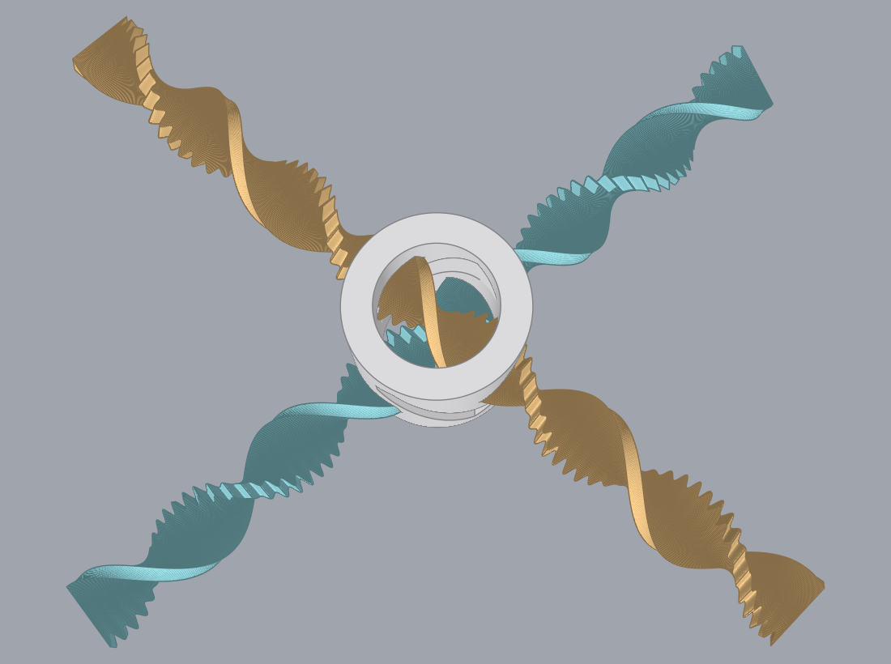

Both gears in the sleeve that "The frame" below describes, seen from almost overhead, which is the
only view that shows the angle their axes cross at. That angle is 80°. The crossed-helical rule
would make it twice the toothed edge's helix angle, which is 87.2° here, and the search picked 80°
instead: at the straight tooth, 90° departed from the 1:1 line by 0.166 mm, 6.3% of the pitch,
against the proof's bound of 6% of the pitch. The leaned tooth is fitted to 80°, and departs by
0.018 mm, 0.7%, there.

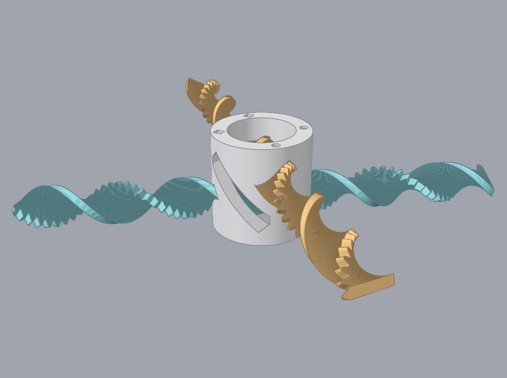

The same assembly from the side. The two axes are 13.95 mm apart along the frame's own axis, and the
two gears are the same part, held alike, both mounting angles 0°: each toothed edge points
straight at the other ribbon where the axes cross. Equal angles from −12° to +12° drive with the
tips 0.35 mm short, far wider than the 1.53° a ribbon rolls in its bores ("The play in the
bores" below).

## The frame

The frame was first the one in the video, an open skeleton of thin round rods. On 2026-09-30 the
user reported that it is not practical to print: printed several times, its thin parts wobbled
while the printer laid them down. The sleeve replaced it. The four bores did not change, because
they hold each gear to its screw motion, and the mesh still has to be visible from the top and
the bottom. [sleeve_test.go](sleeve_test.go) proves the sleeve.

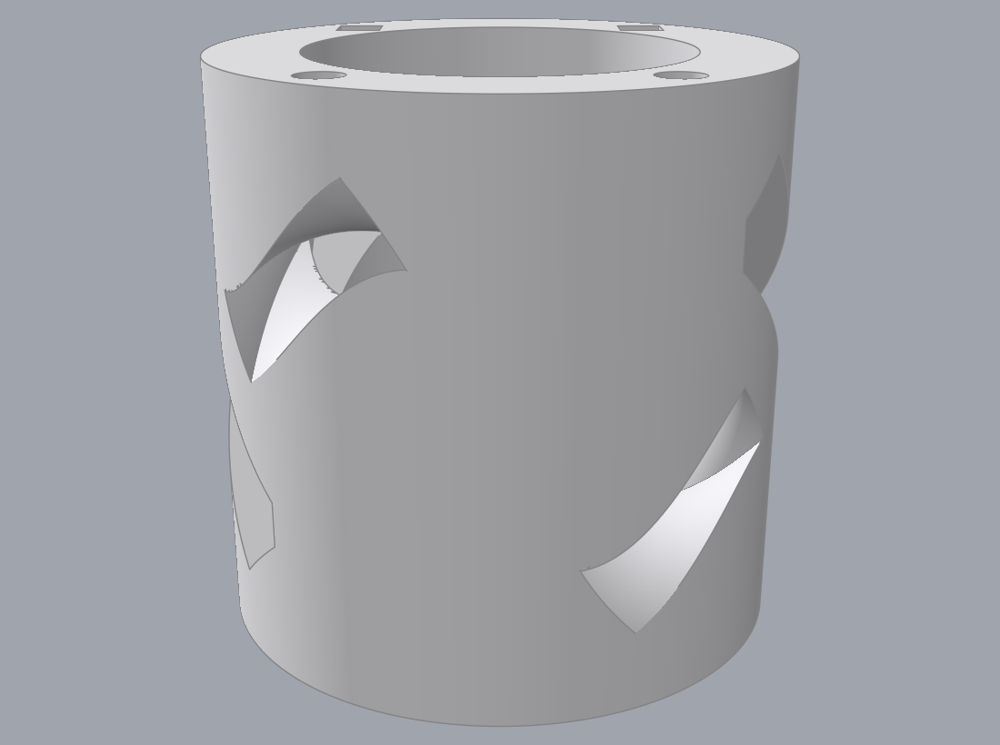

The sleeve's working volume is one thick-walled tube about the frame's axis with four bores and
two slanted windows cut through its wall. The add-in also raises four small marks on the top end:
circles beside the `+R` bores and squares beside the `-R` bores. The proof and its pictures omit
the marks; they measure the bores and the tube below them. The sleeve's inner radius is
`CageRadius − CollarHalf`,
12 mm, and its outer radius `CageRadius + CollarHalf`, 18 mm, so on each bore's centre line the
6 mm wall runs from station 12 to station 18 mm of the gear's axis, and the far face of the bore
at 18 mm is what limits the travel. It stands 18.75 mm either side of the middle plane, 37.5 mm
tall: its `CageRise` is 18.75 mm, 1.25 ribbon widths.

Each bore is the ribbon's crest rectangle plus 0.20 mm all round, 15.4 by 4.15 mm, turned with
the ribbon at its own lead. Every bore passes through level inside the wall, and the printer
bridges its roof; each gear's −R bore has a 0.30 mm **roof allowance** more on that face, so the
−R bores are 4.45 mm through ("The roof allowance" below). The tube's inside is a cylinder, not a plane
square to the ribbon, so the channel's corners reach into the wall before its centre line does.
The cut runs from 1 mm before a corner first touches the inner cylinder, station 7.89 mm of the
gear's axis, to 1 mm outside the tube, station 19 mm, and turns 80.8° over those 11.1 mm. The
clearance was 0.45 mm until a print of 2026-10-02 showed the teeth not meshing over the play it
allowed ("The play in the bores" below).

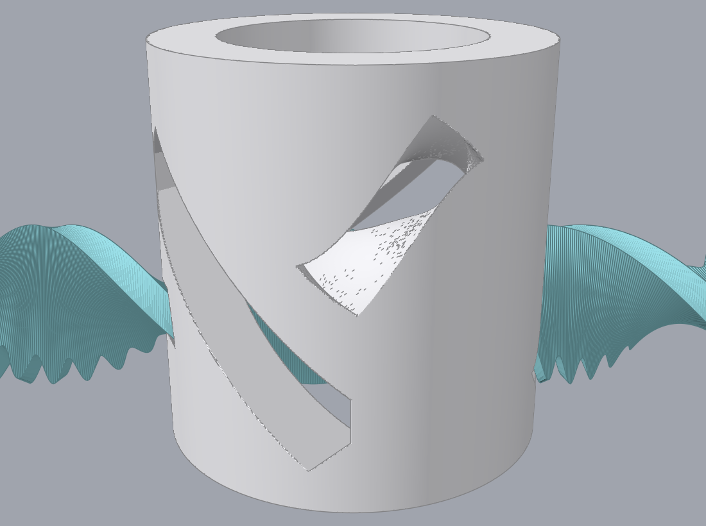

One gear passes through the sleeve by its two holes, which sit on opposite sides of the tube at
the gear's own height, 6.98 mm below the middle for gear A and as far above it for gear B, so
the two gears pass at different heights and their teeth meet in the middle. A half turn about
the line that bisects the two axes carries gear A's holes onto gear B's. The add-in's top marks
identify the bore signs, and the roof allowance lies under the bridged roofs only when the sleeve
stands on its bottom end, the end below the plane the mechanism was built on.

**The bores hold each gear to its screw motion.** Each bore is twisted at the ribbon's own lead,
so a gear that turns without advancing jams in it. `TestSleeveAdmitsOnlyTheScrewMotion` measures
that: 1.60° out of step and the gear's crests and back corners lock. A frame of round holes would
report no jam at any angle, which is the case that rules out.

**The teeth run through the bores.** The crest of a cosine rack is the ribbon's outer edge, so
the crest rectangle holds every point of the ribbon and the bore needs nothing shaped like a
tooth. What bears on the bore's toothed side is the crests, one every pitch; the back edge and
the faces run the clearance from the wall at every station, the −R bores' roofs the clearance
and the roof allowance. `TestRibbonsStayInsideTheirBoresOverTheTravel` holds every point of the
ribbon inside every bore by the clearance at every phase of the travel, and holds each side of
the bore to the clearance, 0.200 mm, and each −R roof to 0.500 mm, so the bore is cut to the
ribbon and not merely round it. `TestRibbonsClearTheSleeveOverTheTravel` walks both ribbons'
crest rectangles, grown by the clearance, over the whole travel and finds no point of them in
the sleeve; outside the bores' cuts the ribbons keep 1.00 mm from the tube.

**The roof allowance.** Standing on an end, every bore of the sleeve passes through level, at
stations −12.37 and +12.37 mm, and the printer bridges its 15.4 mm roof across the hole. At the
14° mounting angles the second sleeve was printed at, only the −R bores did, at station −14.30
mm, and the +R bores came no nearer level than 11.3°. The second sleeve, printed on 2026-10-02 at a 0.20 mm
clearance all round, came out with its two −R bores too tight to pass the ribbons and its two +R
bores fine, so the −R roofs most likely sagged
([`spec/screwgear/fusion.md`](../../spec/screwgear/fusion.md) `[SCREW-F-PRINT-2]`). Each gear's
level bore, the −R bore, has 0.30 mm more room on the long face that is its roof when the
sleeve stands on its bottom end: the +v face for gear A and the −v face for gear B, 0.50 mm in
all. `levelBore`, `roofSide` and `boreOpening` in [sleeve_test.go](sleeve_test.go) pick the bore
and the face, and every channel the proof walks uses that opening. The sleeve has to be printed
standing on its bottom end, the end below the plane the mechanism was built on; stood on the
other end, the allowance would be on the floors. `TestRoofAllowanceAddsOnlyATilt` holds that the
allowance lets a ribbon move and roll no further than before, and measures what it does add: a
tilt, which carries one ribbon's crossing 0.248 mm instead of 0.200 mm from the other. Since both
mounting angles went to 0° on 2026-10-03, the +R bores are level too, and their bridged roofs
keep the 0.20 mm alone; the levelBore rule gives the allowance to one bore of each gear, and the
two tie, so it goes to the −R bore. Whether the +R bores pass the ribbons only the next print
settles (`[SCREW-F-PRINT-3]`).

**The travel is most of the ribbon.** Nothing on the ribbon limits it, since any stretch of the
ribbon fits a bore; a gear runs until an end reaches a bore's far face, which is 142.5 mm for a
ribbon in its own two bores, and 141.2 mm for the pair, 53.8 teeth, because gear B sits 1.31 mm
along its axis at the assembly phase and reaches one bore's end that much sooner. The teeth are
still meshing at both ends of that; an end would leave the engaged zone at 79.6 mm.
`TestTravelIsTheRibbonBetweenItsBores` walks both limits. In the video, at 5:53 the frame sits
near one end of a ribbon where at 6:00 it sits near the middle, so that gear too travels most of
its length.

**The mesh is seen down the hollow.** The two ribbons cross and mesh in the middle of the tube,
and the tube is open at both ends.

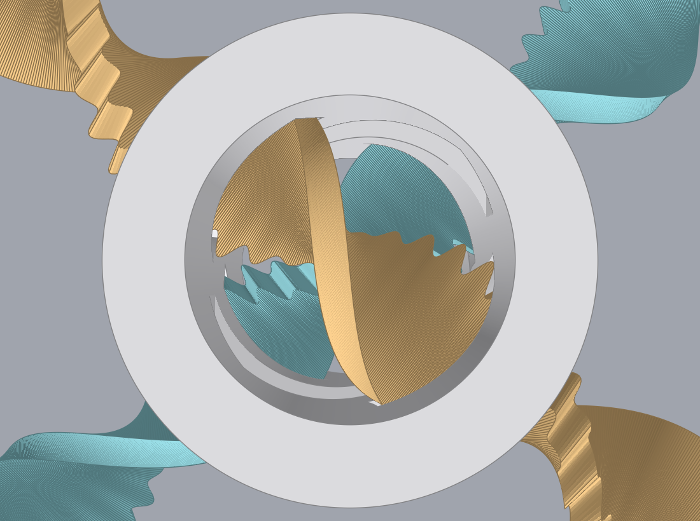

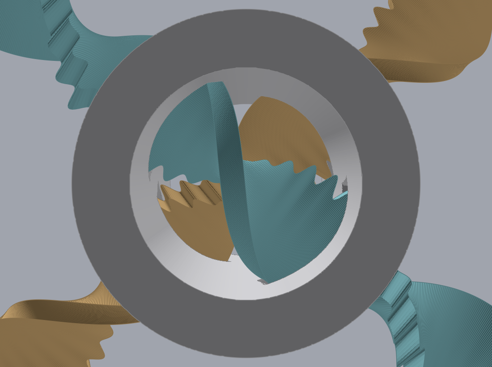

`TestSleeveKeepsTheMeshVisibleAlongTheAxis` projects everything either ribbon reaches within the
engaged zone onto the plane square to the axis. That footprint reaches 11.24 mm from the axis.
Grown by the clearance as a box, the crest rectangle widened on every side and the zone
lengthened at both ends, it reaches 11.60 mm, inside a hollow of radius 12 mm. The test follows
the line along the axis through every point of the grown footprint from one end of the sleeve to
the other without meeting material. The build refuses an input whose footprint and clearance would reach the inner
radius; `TestSleeveInputsAreChecked` reaches that refusal with a 1.5 mm engagement.

**The mesh is also seen from the side, through two slanted windows.**

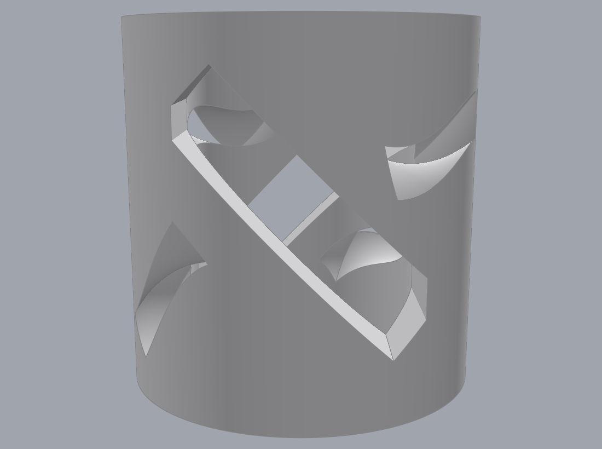

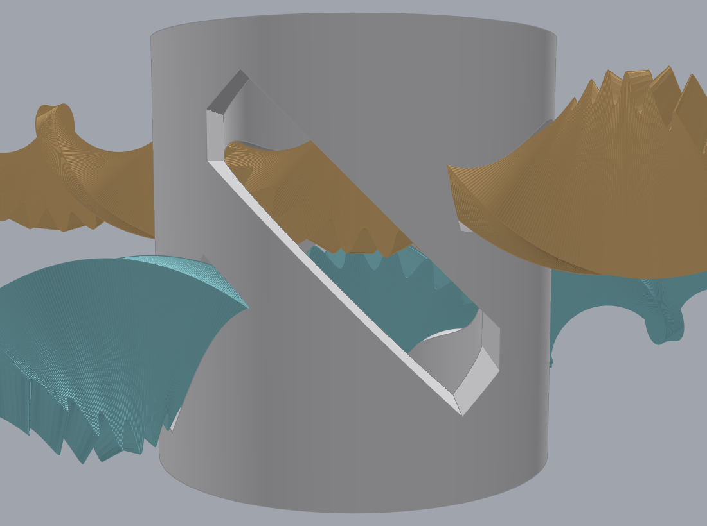

The four bores sit round the tube at 40°, 140°, 220° and 320°. Across the +X and −X sides the
neighbouring bores are 80° apart and their channels come within 5.07 mm of each other across −X,
which leaves no room for a window with a 3 mm `CollarWall` on both sides of it. Across +Y and −Y
they are 100° apart, one bore low and the other high, and the wall between them is a band that
runs at about 45° from above the low bore down to below the high one. Each window is cut along
that band, one facing +Y and one facing −Y. Without the roof allowance the −Y window would be
the +Y window turned half a turn about X, as the bores are; gear A's −R bore flanks the −Y window,
and its roof allowance narrows that window's band from 7.33 to 7.12 mm.

A window is a six-sided hole drawn on the plane through the frame's axis square to the direction
it faces and pushed straight out through the wall on that side. Its two long sides are 45° lines
7.33 mm apart, 10.36 mm measured up the axis. Its two ends are upright, 23.14 mm apart across the
window. Two 45° lines trim its long corners. Every edge is upright or at 45°, so standing on
either end the printer lays the window's roof on the layer below it and bridges nothing; that is
why the window is slanted rather than a level slot, whose roof would be a bridge.

Every dimension comes from the sleeve's own geometry. `newWindow` in
[sleeve_test.go](sleeve_test.go) finds how far each of the two flanking bores' channels reaches
across the band, where it lies in the wall, and sets the long sides a `CollarWall` beyond. It
stands each end as far out as it can while the end's corner lines through the wall, and its
upright edges on the inner and the outer face, stay a `CollarWall`, plus 0.076 mm for what the
sampling can miss, from the other two bores. At the 0.45 mm clearance the defaults had before
2026-10-02 the corners were what held the ends; at a 0.2 mm clearance, with the mounting angles
and engagement of that time, the corners alone would have let an end's inner edge come 2.60 mm
from a bore, and the edges are what hold them. No end stands further than `SleeveOuter/√2` from the
middle, which keeps its roofs off the outer face at the angle the next paragraph describes for
the inner one. The trims keep the window within the 13.81 mm of the middle
the channels already reach, so both end bands keep the 4.94 mm end wall. They also keep each long
side from meeting the inner face more than 45° round from the window's facing direction. Where a
45° roof meets the curved inner face, the line they meet on descends more gently than the roof,
and past 45° round it is flatter than the 0.25 mm grid's 45° rule accepts.

`TestSleeveWindowsKeepTheirWalls` holds the walls round the windows. Each flanking bore's channel
lies exactly 3.000 mm beyond one of the window's long sides, measured on the window's plane. That
settles the bore without sampling: a point is never nearer the window in space than its
projection is on the plane. The other two
bores are measured in space from every face of the window's cut, sampled every 0.1 mm, and keep
3.076 mm. The windows reach 13.67 mm from the middle, inside the 13.81 mm the channels reach;
every edge rises at 45° or more; the window's faces meet the tube at edges of 50.0° or more; and
the lines where its roofs meet the tube descend at 35.3° or more, one cell diagonally on the grid.
The +Y window is 220.7 mm² on its plane and takes about 1500 mm³ of wall, the −Y window 213.8 mm²
and about 1453 mm³.

`TestSleeveWindowPostsStandFirm` cuts level sections every 0.1 mm and walks each round the inner
face, the middle of the wall and the outer face at 0.1° steps. The narrowest post beside a window
is 3.73 mm, between gear B's +R bore and the +Y window. Where a post is narrower than two
`CollarWall`s, 6 mm, the tallest unbroken stretch is 2.6 mm tall on 3.73 mm: 0.70 times its width,
against a limit of 2.

`TestSleeveWindowsShowTheMeshFromTheSide` takes the 4896 points of the mesh zone that the axial
test projects into the footprint, sampled every 0.25 mm of station, and asks of each whether a
straight line from it leaves the tube through a window without touching either ribbon's crest
rectangle. 3993 of them can be seen, 81.6%: 48.7% through the +Y window and 48.4% through the −Y
window. Along a level line, as someone beside the frame at the mesh's height would look, 55.8% can
be. The plain tube has no opening in its side but the bores, and the ribbons fill those.

**It prints standing on its bottom end, with no support.** Every outside face is a vertical
cylinder or a flat end ring of 565.5 mm², and every face of a window is upright or at 45°.
`TestSleevePrintsStandingOnEitherEnd` samples the sleeve on a 0.25 mm grid and finds every cell
with no material within one cell under it, which is a 45° rule at that size. Standing on its
bottom end there are 1429 such cells, 89 mm², and on its top end 1428, 89 mm²; every one is in
the roof of a bore. Nowhere else does the printer lay material on air. The unmarked proof body
prints on either end, but only the bottom end puts the roof allowance under the bridged roofs.
The same test holds the end wall above and below the channels, 4.94 mm, and the two nearest
channels, gear A's and gear B's
−R bores 5.07 mm apart, over the 3 mm `CollarWall`, and logs the edge each hole's mouth leaves:
47.8° on the inner face and 63.4° on the outer. `TestSleeveIsOnePiece` flood-fills the same grid
and reaches every cell: one piece of 16,602 mm³, about 21 g of PLA.

| Quantity | Value |
|---|---|
| Sleeve | radius 12 to 18 mm, a 6 mm wall, 37.5 mm tall |
| Bore | 15.4 by 4.15 mm, the −R bores 4.45 mm through with the 0.30 mm roof allowance, cut over stations 7.892 to 19 mm of its gear's axis and turning 80.78° over them |
| Play in the frame | the bores jam a gear 1.60° out of step |
| Play in the bores | each ribbon moves 0.20 mm toward, away or sideways and rolls 1.53°; the roof allowance adds a tilt that carries a crossing 0.248 mm |
| Frame to ribbon | no point of either ribbon, grown by the clearance, in the sleeve over the travel; 1.00 mm from the tube outside the bores' cuts |
| Mesh footprint | 11.24 mm from the axis, 11.60 mm grown by the clearance as a box, inside the 12 mm inner radius |
| Windows | two, facing +Y and −Y; long sides at 45°, 7.33 and 7.12 mm apart (10.36 and 10.07 mm up the axis); upright ends 23.14 and 23.11 mm apart; 220.7 and 213.8 mm², about 1500 and 1453 mm³ |
| Window to channel | 3.000 mm to the flanking bores, measured on the window's plane; 3.076 mm to the others, sampled in space |
| Beside the windows | the narrowest post 3.73 mm; stretches under 6 mm wide at most 0.70 times as tall as they are wide |
| Side view | 81.6% of the mesh zone seen through a window past both ribbons, 55.8% along a level line |
| Base in the proof | a 565.5 mm² flat ring at either end; the add-in raises marks on the top end |
| Material laid on air | 1429 cells of 0.25 mm, 89 mm², standing on the bottom end, 1428 on the top end, all in the bores' roofs |
| End wall | 4.94 mm above and below the channels and the windows |
| Between channels | 5.07 mm at the nearest, gear A's and gear B's −R bores; the build's check (`channelSeparation`) holds them 5.07 mm apart |
| Hole mouths | 47.8° edges on the inner face, 63.4° on the outer |
| Volume in the proof | 16,602 mm³, about 21 g of PLA, before the four raised marks |
| Build's twist check | probes at stations ±15 mm, 16.63 mm from the axis, inside the channel under the right twist sense; under the wrong one they sit 6.46 and 7.39 mm across a channel 2.075 mm half thick, in the wall |
| Bore wall stand-in | a ruled wall through 18 sections leaves 0.194 mm of the 0.20 mm clearance; decad's two triangles a cell depart from it by up to 0.32 mm |

**The windows follow the sleeve's size.** `TestSleeveWindowsFollowTheSize` builds the sleeve at 33
inputs away from the defaults — the whole ribbon and frame scaled from 2/3 to 1.75 with the 3 mm
wall and the 0.20 mm clearance held, and the width, thickness, lead, cage radius, rise, clearance,
collar half length, `CollarWall`, crossing angle and mounting angles moved one or two at a time —
and on every window it cuts runs every check the default windows pass, with the one-piece and
printing checks on the same 0.25 mm grid. Past a right-angled crossing the wider gaps between the
bores are the ones across ±X, and the windows face those. Every window passes. A window the bores
leave no room for is left out; no input the build accepts reaches that, and the test leaves both
windows out at a 7 mm `CollarWall`. The same run found that the sleeve itself needed a fourth
input check: at two of the inputs two neighbouring bores come nearer each other than `CollarWall`
(2.93 mm for the sleeve scaled by 2/3 with the 3 mm wall kept, 3.95 mm for a 4 mm wall with a
0.55 mm clearance), which no closed form on the inputs predicts. `channelSeparation` is the build's check. It projects the two bores' sampled
outlines onto the plane across their gap and takes how far apart the two convex hulls stand, which
can only be less than the distance between the outlines; the build refuses the input when that is
under `CollarWall`. It is 5.07 mm at the defaults, and of the 33 inputs it refuses exactly those
two. Those counts are the full sample's; by default the test builds five of the 33 inputs
("Running the proof" below). Finding each end walks the far bores' channels at 2
µm stations; `wallGap` now builds each bore's stations once and walks out from the nearest,
stopping where no further station could come nearer, which gives the same distances and cuts
building both windows from 1.2 s to 0.07 s.

**What the proof cannot reach.** Every bore passes through level: its 15.4 mm-wide roof is flat
at station ±12.37 mm, inside the wall near its inner face, and the printer has to bridge it
across the wall. The second sleeve showed bridged roofs closing up a 0.20 mm clearance; whether
the 0.50 mm under the −R roofs is enough, and whether the +R roofs, at 0.20 mm, pass the ribbons,
only a print settles. The proof takes the bore as drawn, with no sag at all; it logs the roofs and enforces
nothing about them. The add-in at c8a63b5 built the 0.45 mm sleeve that
was printed on 2026-10-02, and the ribbons screwed through its bores; nothing else was read
from that load, so the steps that build the sleeve, the tube's sketch and extrude, the four
twisted sweep cuts that start in air, and each window's one sketch of the hexagon on the plane
through the axis and one cut extruded from it through the wall on one side, have no measurement
from Fusion. Where a window's roof meets the inner face, the line it meets on descends
at 35.3° at the flattest; the grid takes that as one cell diagonally, and whether a slicer lays a
short unsupported edge there only a print settles.

**The spec and the add-in build the sleeve.**
[`spec/screwgear/instructions.md`](../../spec/screwgear/instructions.md) §4 builds the sleeve and
sizes its windows by `newWindow`'s search, and its "What the print showed" records the
2026-09-30 report on the video's frame. `lib/geargen/screwgear.py` is emitted from that spec's
compiled step list and builds the sleeve too; until the step list is compiled again from the
spec of 2026-10-03 it builds the straight tooth at 14°. The three prints of the sleeve are recorded
there and in [`spec/screwgear/fusion.md`](../../spec/screwgear/fusion.md) `[SCREW-F-PRINT-MESH]`,
`[SCREW-F-PRINT-2]` and `[SCREW-F-PRINT-3]`.

## The mesh

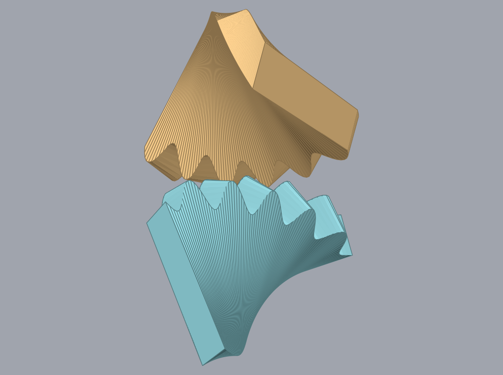

The crossing, close up. The crests of the lower gear sit in the roots of the upper one, engaged
1.05 mm of the 2.625 mm tooth height. This is the picture that settles whether the teeth engage at
all, which is the one thing about this gear that no number on a page shows.

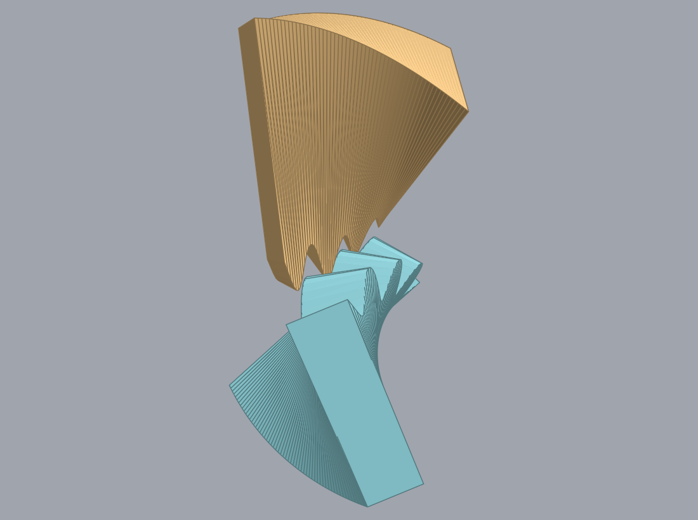

The same engagement from across the crossing, where each ribbon's teeth are seen leaning across
its thickness. The two ribbons' axes cross at 80°, and a ridge that ran straight across its
ribbon, square to the axis, crossed the other ribbon's at 74–80° where they touched: a corner of
one tooth met the other's flank at a point. The third sleeve's teeth slipped for that reason
(`spec/screwgear/fusion.md` `[SCREW-F-PRINT-3]`). The leaned ridges lie along each other where
the teeth touch, so the pair carries a **line contact**: `TestTeethTouchAlongALine` in
[contact_test.go](contact_test.go) finds at least 2.67 mm of the touching ridge, 97% of it,
within 0.05 mm of the other flank at every driving pose, and `TestStraightRidgesTouchAtAPoint`
finds none of the straight ridge's. The lean is also why both mounting angles are 0°: with
straight ridges pointing straight at each other, about four tooth pairs land in the engaged zone
at once and cannot all interdigitate, and the pair jams. `TestSymmetricMountNeedsTheLeanedRidge`
holds both.

## What the proof measures on these parts

| Quantity | Value |
|---|---|
| Ratio | 1:1, the free window advancing exactly one pitch per pitch |
| Backlash | 1.063–1.103 mm |
| Departure from the 1:1 line | 0.018 mm, 0.7% of the pitch |
| Contact | at least 2.67 mm of the touching ridge, 97% of it, within 0.05 mm of the other flank at 24 driving poses; the ridges within 0.3° of parallel |
| Slack between the ribbons at the assembly phases | 1.137 mm at the closest approach, in the mesh, with gear B in the middle of a 1.063 mm window |
| Mesh over the bores' play, tips 0.35 mm short | 100 of 100 pose pairs drive in the full sample, windows 0.669–1.496 mm, at least 1.39 mm of the touching ridge within 0.10 mm of the other flank |
| Bore | 15.4 by 4.15 mm, the crest rectangle plus 0.20 mm all round and 0.30 mm more on each −R roof; the ribbon at 0.200 mm on every other side over the travel |
| Travel | 141.2 mm, 53.8 teeth, 79% of the ribbon: 69.9 mm back and 71.3 mm forward of the assembly position |
| Ribbon to ribbon outside the engaged zone | 3.62 mm at every phase of the travel, at station 8.40 mm, crest rectangle against crest rectangle |

`TestPairDrivesOneToOne` in [pair_test.go](pair_test.go) is where the first three come from,
`TestTeethTouchAlongALine` in [contact_test.go](contact_test.go) the fourth,
`TestFullRibbonsClearOutsideTheEngagement` the fifth, and `TestPairDrivesUnderBorePlay` in
[bore_play_test.go](bore_play_test.go) the sixth. `TestPairDrivesOneToOne` It tracks the interval of
gear B's tooth phase that clears gear A through a full pitch of A, and requires three things of
it: that it is never empty, that it is narrower than a pitch, and that its centre advances by
exactly one pitch. The third is what separates a gear from two parts that merely touch, and an
arrangement tried earlier passed the first two and failed it. The sampling every number in the
table was taken with is fixed at the top of that file and quoted in the spec's "Defaults", and
so are its bounds, which are fractions of the pitch: the departure under 6% of it and the window
within 7% of it of the backlash quoted above. `TestRibbonsStayInsideTheirBoresOverTheTravel`,
`TestTravelIsTheRibbonBetweenItsBores` and `TestRibbonsClearEachOtherOutsideTheEngagement` in
[sleeve_test.go](sleeve_test.go) give the last three.

### The play in the bores

On 2026-10-02 the user printed the sleeve at the defaults of that day, a 0.45 mm clearance, a
0.75 mm engagement and 15° on both gears, with two ribbons of the same part. The ribbons screwed
through their bores and the teeth did not mesh. A bore is the crest rectangle plus the clearance
all round, so a printed ribbon is not held on its nominal axis: at 0.45 mm it could move 0.45 mm
toward or away from the other ribbon, which changes the engagement, and roll 3.44° about its own
axis, which changes the mounting angle the mesh sees. The pair drove only from 11° to 16° of
equal mounting angle at that engagement, and `TestPairDrivesOneToOne` measured the nominal pose
alone. [`spec/screwgear/fusion.md`](../../spec/screwgear/fusion.md) `[SCREW-F-PRINT-MESH]`
records the print and the fix.

The defaults then became a 0.20 mm clearance, a 0.90 mm engagement and 14° on both gears; the
ribbon did not change. The second sleeve was printed at that fit the same day, and once its −R
bores were chiselled open the teeth meshed only sometimes (`[SCREW-F-PRINT-2]`). The third, with
the roof allowance, fitted, and the teeth slipped because they touched at a point
(`[SCREW-F-PRINT-3]`); since 2026-10-03 the defaults carry the leaned tooth, 0° on both gears and
a 1.05 mm engagement. A printed
tooth's tip comes out rounded and short, which the model's exact cosine does not, so the cases in
[bore_play_test.go](bore_play_test.go) cut both ribbons' crests flat 0.35 mm down, move each
ribbon inside its bores, and run the mesh at every pair of poses:

| Case | Pose pairs | Result at the defaults |
|---|---|---|
| `TestPairDrivesUnderBorePlay`: toward and away at every whole degree of roll, the roll limits, and the two tilts the roof allowance opens | 100 | all drive, none jams; the touching ridge at least 1.39 mm within 0.10 mm of the other flank |
| `TestPairDrivesUnderSidewaysPlay`: each ribbon 0.20 mm sideways either way | 16 | all drive |
| `TestRoofAllowanceAddsOnlyATilt`: moves, rolls and tilts with and without the allowance | — | moves and rolls unchanged; a tilt of up to 0.86° carries a crossing 0.248 mm against 0.200 mm |
| `TestPrintedFitFailsUnderBorePlay`: the first print's values and straight tooth, limits only, the model's own tips | 16 | 6 let the teeth pass, so the check fails the print |
| `TestSecondPrintMeshIsMarginal`: the second print's fit and straight tooth, both ribbons pulled apart | 1 | drives with the tips 0.40 mm short, lets the teeth pass at 0.45 mm |

The pose-pair counts are the full sample's. By default the first, second and fourth cases run a
smaller sample, described in "Running the proof" below.

A jam is accepted when it closes the two axes by at least a clearance with neither ribbon pulled
away from the other: the parts cannot both be in that pose, so the teeth push the ribbons out of
it, and only pressing them together reaches it. A pose pair that lets the teeth pass is never
accepted. At the straight tooth the search found the mesh driving only while the two mounting
angles' sum stays in a band a few degrees wide, and a deeper engagement narrowing that band
rather than widening it, so looser bores, which let the ribbons roll further, could not be made
to mesh (`spec/screwgear/mesh-search.md`, "The search for a mesh that survives a print"). With
the leaned tooth equal angles from −12° to +12° drive, with the tips short.

## What has no picture

**The tooth cell and its screw step.** The spec builds a ribbon as one four-tooth cell repeated
by a screw step, five copy-move-join rounds at the defaults, and
`TestRibbonIsInvariantUnderItsScrewStep` is what licenses that: it carries the corners and the
toothed points of every cross-section through one step and requires them to land on the next
tooth's. The spec's check of the slant's sign, four probes of the lofted cell
(`TestToothSlantProbesTellTheHand`), has no picture either.
`TestDoublingScheduleCoversTheRibbon` holds the schedule. The pictures draw the whole ribbon from
its sections and never form a cell.

**Anything a generator does.** `lib/geargen/screwgear.py` builds the gear from the compiled step
list `spec/screwgear/steps.md`, but nothing here draws that build sequence step by step the way
[`proof/bevelgear/README.md`](../bevelgear/README.md) does. The files named here —
[geometry_test.go](geometry_test.go), [pair_test.go](pair_test.go),
[contact_test.go](contact_test.go), [tooth_test.go](tooth_test.go),
[bore_play_test.go](bore_play_test.go), [sleeve_test.go](sleeve_test.go) and
[render_test.go](render_test.go) — are the hand-written mechanism proof; `/compile-gear` writes the step proof, the `compiled_*_test.go` files, beside
them and leaves them alone.

## Running the proof

`proof/run.sh` runs this package with the rest of the suite, which is what CI runs. On its own:

```sh
proof/run.sh --package ./screwgear -- -count=1
```

Four cases run a smaller sample by default, and CI runs that sample. Setting the environment
variable `SCREWGEAR_FULL` to `1` runs the full one:

```sh
SCREWGEAR_FULL=1 proof/run.sh --package ./screwgear -- -count=1
```

It is an environment variable rather than a test flag such as `-render.out` because `go test`
hands every argument after a flag it does not know to the test binary, and `run.sh` puts the
package list last, so the package list would go with it. A value other than empty, `0` or `1`
fails those four cases. Each case logs which sample it ran, and each comment in
[bore_play_test.go](bore_play_test.go) and [sleeve_test.go](sleeve_test.go) says what its default
leaves out:

| Case | Full sample | Default sample | What the default leaves out |
|---|---|---|---|
| `TestPairDrivesUnderBorePlay` | 10 poses a ribbon, every pair: 100 | 6 poses a ribbon (toward and away at no roll, the roll limits, the two tilts), each against the same pose of the other ribbon: 6 | the whole degrees of roll short of the limits, and every pair of two different poses |
| `TestPairDrivesUnderSidewaysPlay` | 16 | both ribbons at the same sideways limit, and each at either sideways limit against the other pushed toward it: 6 | the other ribbon at rest or pulled away, and the two at opposite sideways limits |
| `TestPrintedFitFailsUnderBorePlay` | 4 limits a ribbon, every pair: 16 | each limit against the same limit of the other ribbon: 4, two of which let the teeth pass | every pair of two different limits, among them four more that let the teeth pass |
| `TestSleeveWindowsFollowTheSize` | 33 inputs | 5: everything scaled by 0.75, a 110° crossing, a 5 mm `CollarWall`, and the two inputs the build refuses | 28 inputs the build accepts |

The default sample keeps the nominal pose, every kind of move in the bores (toward and away,
sideways, roll and tilt), the full sample's narrowest and widest windows and least contact in
the first case and its narrowest window in the second, and a failure of the first print on both a
move and a roll. `TestSecondPrintMeshIsMarginal` is
one pose pair at two tip losses, the least that shows an edge, so it has no smaller sample.

At the defaults on 24 cores the package takes about 38 s with the default sample and about 70 s
with the full one. Run the full sample before trusting a change to the bores, the mesh or the
window rule.

## Regenerating

```sh
cd proof
GOWORK=off go test ./screwgear -run '^TestRender' -render.out=./images -count=1
```

`./images` is relative to this directory rather than to the one the command is run from, because
`go test` runs a test binary in its own package's directory.

`GOWORK=off` is what [render_examples.sh](../render_examples.sh) uses and for the same reason:
the images are then built against the engine revisions `proof/go.mod` pins, out of the module
cache, rather than against whatever checkout sits beside the repository. `-count=1` is needed
because a cached PASS writes no files.

`TestRenderSleeve` takes about 50 seconds, most of it meshing the sleeve on its 0.1 mm grid;
`-run '^TestRenderSleeve$'` regenerates every picture with the sleeve in it, `plan.png` and
`pair.png` included.

Nothing checks these images. They are regenerated by hand when the geometry changes.
