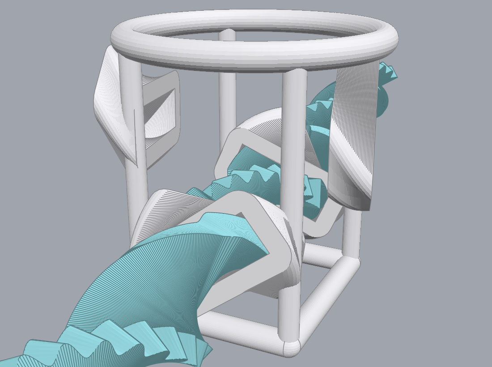

# The screw gearing, in pictures

These are the parts [`spec/screwgear/instructions.md`](../../spec/screwgear/instructions.md)
describes, drawn at the defaults that spec's table gives. Every section in every picture comes
from `Gear.section` in [geometry_test.go](geometry_test.go), the same function the meshing proof
samples, so a change that moves the proved geometry moves these pictures with it. The three
`TestRender` cases in [render_test.go](render_test.go) write them, and they run only when
`-render.out` names a directory, so an ordinary proof run writes no images.

The mechanism is a screw/screw gearing: two racks, each twisted into a helix about its own centre
line, each moving by a screw motion — turning as it advances — in a cage that holds them. Pushing
one along its axis drives the other, 1:1. It comes from Henry Segerman's video
[Screw/screw gearing](https://www.youtube.com/watch?v=0ZPo3HxR0KI), which is the only known
example of one.

## What the pictures show, and what they do not

No image here comes from Fusion, and nothing in this directory builds a Fusion body. Loading a
gear into Fusion is still the only check that sees the real thing.

The pictures draw the **ideal** ribbon: an exact cosine edge on an exact helicoid, which is what
the proof reasons about. The part Fusion builds lofts eleven rectangles per tooth, and
`TestLoftSectionCountHoldsTheHelicoid` bounds the difference between the two at 0.7 µm against a
0.50 mm backlash. That bound is arithmetic about the loft rather than a measurement of one.

The frame's parts are drawn one by one and laid over each other rather than joined: the ring as a
torus, the rods and the loop's bars as plain cylinders with a ball at each corner, and each collar
as the bore's outline grown by the wall and swept through thirty-two stations along its ribbon.
Where a rod runs into a collar's wall the picture shows both surfaces, and the part has one.

The channel's own wall is smooth here and faceted in the part. Fusion cuts it with a loft through
fifteen rotated rectangles, so the wall is flat between them and every facet stands a little
inside the true channel. `TestBoreLoftKeepsItsClearance` measures what that costs the gear:
0.005 mm of the 0.30 mm clearance. It is the one case in this package that looks at what the build
will really cut rather than at the ideal shape.

## The part


One gear. It is a flat plate 10 mm wide and 2.5 mm thick with a cosine tooth form cut into one
long edge, 80 teeth at a 1.75 mm pitch, twisted about its own centre line at 33 mm per turn — a
little over four full turns across its 140 mm.

The toothed edge is the one that spirals, and the twist is what the crossing angle is made of:
`Sigma = 2*Beta` ties the two axes' angle to this edge's own helix angle, so a slower twist would
give a straighter part AND a pair whose axes lie almost side by side.

The teeth are 1.2 mm from crest to root, a little over a tenth of the plate's width. The teeth
on the model in the video read deeper, about a sixth of the width and about one pitch, so they
look like a saw where these look like a wave; the spec's "What the video shows" table records
that reading and why the depth stays.

## The pair


Both gears, seen from almost overhead, which is the only view that shows the angle their axes
cross at. That angle is 80°. The crossed-helical rule would make it twice the toothed edge's helix
angle, which is 87.2° here, and the search picks 80° instead: at 90° the pair departs from the
1:1 line by 0.187 mm against the proof's 0.10 mm bound.


The same assembly from the side. The two axes are 9.64 mm apart along the frame's own axis, and the
two gears are the same part, held at the same 15° angle, which is the smallest equal angle that
drives at this twist.

## The frame



The frame with one gear left in it. It is the frame in the video: an open skeleton of round rods,
with no wall, no plate and no post. A round wire **ring** stands at one end and a smaller **loop**
with straight sides at the other, four thin **rods** run between them, and a short **collar** sits
round each ribbon where it crosses. The ring is 27.5 mm across, 2.75 ribbon widths, and the frame
is 29.5 mm tall; the spec's "What the video shows" table puts both against the video's readings.

**The collar is what holds a gear to its screw motion.** Its bore is cut to the ribbon's own
cross-section and twisted at the ribbon's own lead, so a gear that turns without advancing jams in
it. `TestBoresAdmitOnlyTheScrewMotion` measures that: 3.21° out of step and the gear locks. A frame
of round holes would report no jam at any angle, which is the case that rules out. The collar's
outside is that bore grown by a 2 mm wall in every direction of its own section, which rounds every
corner off, and it turns with the ribbon over its 4 mm length. Two collars sit low and two high, so
the two gears pass at different heights and their teeth meet in the middle.

**A rod stands beside its collar, not on it.** The ribbon runs on through the point where it
crosses the frame, so a rod there would cut it. Each rod stands on the ring's circle, turned round
the ring by the least angle at which it clears both ribbons over the whole stroke — 34.7° for a
gear's collar at `+CageRadius` and 33.7° for the one at `-CageRadius` — and runs through its
collar's 2 mm wall, which is what joins the two. All four are turned the same way round, so they
land in the gaps between the ribbons, and the loop that joins their feet is a rectangle with a
corner at each rod: 19.3 by 16.1 mm inside a 25 mm circle, which is why the loop reads smaller
than the ring.
`TestRodsStandBesideTheirCollars` derives the angles and `TestFrameIsOnePiece` walks ring to rods
to loop and rod to collar.

**Nothing of the frame touches a ribbon but the bore.** `TestRibbonsClearTheFrameOverTheStroke`
walks everything both ribbons reach over the travel against the ring, the loop, the rods and the
collars: 1.59 mm to the ring, 2.53 mm to the loop, 0.32 mm to the rods.

**What passes through a bore is never a tooth.** The ribbon swells into a smooth boss at each of the
two places it crosses the frame, and the bore is cut to the boss. That is why the frame is plain
round bar and plain rectangular openings, with nothing anywhere shaped like a tooth, and why nothing
bears on a crest. The boss travels with its gear, so what is left of its flat top after the collar's
own length is the stroke: 4.2 mm, or 2.4 teeth. The video's ribbons carry no boss: their teeth run
through the collars, and at 5:53 the frame sits near one end of a ribbon where at 6:00 it sits near
the middle, so that gear travels most of its length.

## The mesh


The crossing, close up. The crests of the lower gear sit in the roots of the upper one, engaged
0.60 mm of the 1.2 mm tooth height. This is the picture that settles whether the teeth engage at
all, which is the one thing about this gear that no number on a page shows.


The same engagement from across the crossing. The two tooth rows run at an angle to each other
rather than along one line, so what this pair carries is a **point contact**, like a crossed
helical pair, and not the line contact a spur pair has. That angle is also what the Mounting
Angles are there to work around: with both toothed edges pointing straight at each other, about
four tooth pairs land in the engaged zone at once and cannot all interdigitate, and the pair jams.
`TestSymmetricMountJams` holds that.

## What the proof measures on these parts

| Quantity | Value |
|---|---|
| Ratio | 1:1, the free window advancing exactly one pitch per pitch |
| Backlash | 0.438–0.569 mm |
| Departure from the 1:1 line | 0.067 mm, 3.8% of the pitch |
| Clearance away from the teeth | 0.254 mm at the closest approach |
| Play in the frame | a collar jams a gear 3.21° out of step |
| Stroke | 4.2 mm, or 2.4 teeth |
| Ring | 27.5 mm across, 2.75 ribbon widths and 0.83 leads; the frame 1.07 ring widths tall |
| Rods | 34.7° and 33.7° round the ring from their collars, 7.3–7.5 mm from the crossings |
| Loop | 19.3 by 16.1 mm between the rods' feet |
| Frame to ribbon | 1.59 mm at the ring, 2.53 mm at the loop, 0.32 mm at the rods, over the stroke |
| Bosses to the other ribbon | 0.91 mm outside the engaged zone, at station −4.78 mm |
| Bore wall in the part | faceted by its loft, leaving 0.295 mm of the 0.30 mm clearance |

`TestPairDrivesOneToOne` is where the first four come from. It tracks the interval of gear B's
tooth phase that clears gear A through a full pitch of A, and requires three things of it: that
it is never empty, that it is narrower than a pitch, and that its centre advances by exactly one
pitch. The third is what separates a gear from two parts that merely touch, and an arrangement
tried earlier passed the first two and failed it.

## What has no picture

**The tooth cell and its screw step.** The spec builds a ribbon as one tooth cell repeated by a
screw step, and `TestRibbonIsInvariantUnderItsScrewStep` is what licenses that, but the pictures
draw the whole ribbon from its sections and never form a cell.

**Anything a generator does.** There is no `lib/geargen/screwgear.py` yet, and no compiled step
list, so there is no build sequence to show step by step the way
[`proof/bevelgear/README.md`](../bevelgear/README.md) does.

## Regenerating

```sh
cd proof
GOWORK=off go test ./screwgear -run '^TestRender' -render.out=./images -count=1
```

`./images` is relative to this directory rather than to the one the command is run from, because
`go test` runs a test binary in its own package's directory.

`GOWORK=off` is what [render_examples.sh](../render_examples.sh) uses and for the same reason:
the images are then built against the engine revisions `proof/go.mod` pins, out of the module
cache, rather than against whatever checkout sits beside the repository. `-count=1` is needed
because a cached PASS writes no files.

Nothing checks these images. They are regenerated by hand when the geometry changes.
